# 10 Занятие про Перцептрон

## Что такое нейронная сеть
**Нейронная сеть** — это последовательность нейронов, соединенных между собой синапсами. Структура нейронной сети пришла в мир программирования прямиком из биологии. Благодаря такой структуре, машина обретает способность анализировать и даже запоминать различную информацию. Нейронные сети также способны не только анализировать входящую информацию, но и воспроизводить ее из своей памяти.  

**Аксон** — длинный отросток нейрона. Приспособлен для проведения возбуждения и информации от тела нейрона к нейрону или от нейрона к исполнительному органу.  
**Дендриты** — короткие и сильно разветвлённые отростки нейрона, служащие главным местом для образования влияющих на нейрон возбуждающих и тормозных синапсов (разные нейроны имеют различное соотношение длины аксона и дендритов), и которые передают возбуждение к телу нейрона. 

### Синапс нейронной сети
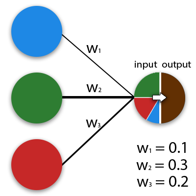

## Перцептрон
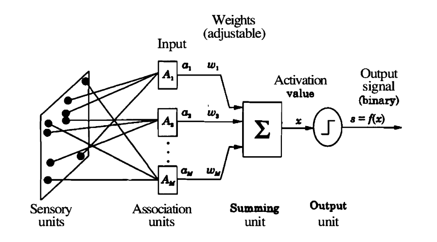

$A$ - входящий вектор признаков  
$W$ - веса модели  
$b = w_0$ - сдвиг модели   
$y$ - результат модели  
$\sigma$ - функция активации

**<center>Смещение</center>**
$$
A_0 = 1
$$
$$
S = \sum_{i=0}^nA_iw_i
$$

X = [x1, x2, x3]; 
W = [w1, w2, w3]; 
$ b = w_0 $
$$
\vec x * \vec W = w_0 + x_1w_1 + x_2w_2 + x_3w_3
$$


## Использование набора данных MNIST в Python
База данных MNIST (сокращение от «Modified National Institute of Standards and Technology») — это набор образцов рукописного написания цифр. 
Является стандартом для калибрации и сопоставления методов распознавания изображений,
с помощью машинного обучения, в первую очередь на основе нейронных сетей.  

### Знакомство
```python
# Importing the necessary libraries
import numpy as np
import matplotlib.pyplot as plt
import torchvision
plt.rcParams['figure.figsize'] = 10, 10
```
Функция стандартизированного изменения изображений
```python
transform = torchvision.transforms.Compose([
                    torchvision.transforms.ToTensor(),
                    torchvision.transforms.Normalize((0.5), (0.5))
                                            ])
```
Назначение переменных использования набора
```python
train_dataset = torchvision.datasets.MNIST(
    root="./MNIST/train", train=True,
    transform=torchvision.transforms.ToTensor(),
    download=False)

test_dataset = torchvision.datasets.MNIST(
    root="./MNIST/test", train=False,
    transform=torchvision.transforms.ToTensor(),
    download=False)
```
Рассмотрим 25 случайных изображений из набора 
```python
# Создаём номера выборки
random_samples = np.random.randint(1, len(train_dataset), (25))

# Раскладываем выборку на холсте
for idx in range(random_samples.shape[0]):
    plt.subplot(5, 5, idx + 1)
    plt.imshow(train_dataset[idx][0][0].numpy(), cmap='gray')
    plt.title(train_dataset[idx][1])
    plt.axis('off')

# Смотрим получившийся холст
plt.tight_layout()
plt.show()
```
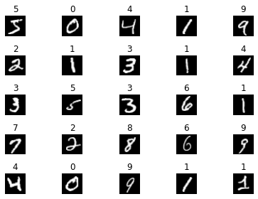  
Элемент `train_dataset[0]` это `(Img, label)`.

### Трансформация в удобоваримый вид
Определение инструментов
```python
def encode_label(j):
	"""
	Переводит число-признак в матрицу:
	5 -> [[0], [0], [0], [0], [0], [1], [0], [0], [0], [0]]
	       0,   1,   2,   3,   4,   5,   6,   7,   8,   9.  
	"""
	
	e = np.zeros((10,1))
	e[j] = 1.0
	return e

def shape_data(data):
	features = [np.reshape(x[0][0].numpy(), (784,1)) for x in data]
	labels = [encode_label(y[1]) for y in data]
	return zip(features, labels)


train = shape_data(train_dataset)
test = shape_data(test_dataset)
```
Проверка
```python
train = list(train)
test = list(test)
print('train imgs -', len(train))
print('test imgs -', len(test))
```
    train imgs - 60000
    test imgs - 10000

## Перцептрон в Python
### Теория
Для обучения перцептрона для распознавания цифр можно использовать следующий подход:  
* Для каждой цифры хранится среднее представление в виде матрицы.
* Подбирается такой вектор весов $W$, чтобы скалярное произведение вектора, представляющего изображение цифры, с этим вектором давало наибольшее значение.  

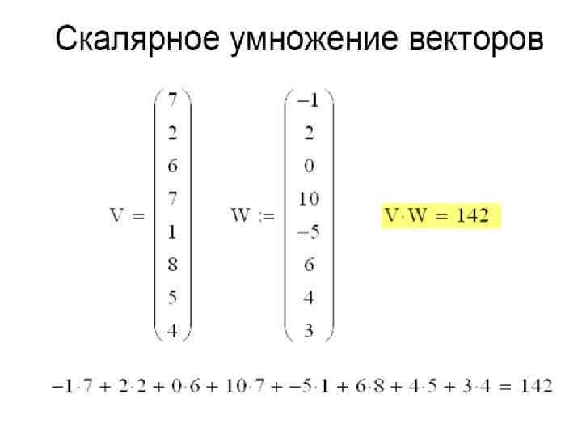  
Где $V$ - это вектор изображения, $W$ - веса нейросети.  

Рассмотрим среднее  представление  цифры  8 (`avg_eight`):
```python
def average_digit(data, digit):
    filtered_data = [x[0] for x in data if np.argmax(x[1]) == digit]
    filtered_array = np.asarray(filtered_data)
    return np.average(filtered_array, axis=0)

avg_eight = average_digit(train, 8)

img = (np.reshape(avg_eight, (28, 28)))
plt.imshow(img)
plt.show()
```
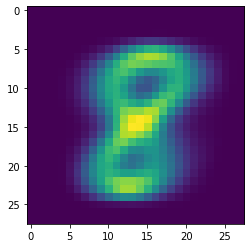  

Это изображение из обучающего набора MNIST содержит большое количество информации о том, какими общими свойствами должны обладать изображения цифры 8.
Мы используем `avg_eight` в качестве параметров простой модели, чтобы определить, является ли данный входной вектор $x$, представляющий изображение цифры, изображением восьмёрки.
В данном случае `avg_eight` выступает в качестве весов.  

```python
# train[ indx ][ img/label ]
x_2 = train[2][0] # 4-ка
x_17 = train[17][0] # 8-ка

img_2 = (np.reshape(x_2, (28, 28)))
img_17 = (np.reshape(x_17, (28, 28)))

plt.subplot(1, 2, 1)
plt.imshow(img_2)
plt.subplot(1, 2, 2)
plt.imshow(img_17)
plt.show()
```
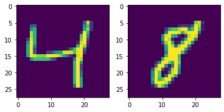

Вычислим скалярное произведение W и x, т. е. попарно перемножим значения W и x и суммируем все 784 результирующих значения.
Если наша гипотеза верна и x соответствует 8,
то более темные пиксели должны располагаться примерно в тех же местах, что и в случае W, и наоборот.
Если же х не соответствует 8, то совпадений должно быть меньше.
Давайте проверим эту гипотезу на нескольких примерах.

```python
W = np.transpose(avg_eight)

res_4by8 = np.dot(W, x_2)[0][0] / np.linalg.norm(W)
print(res_4by8) 
```
    2.7090142
```python
res_8by8 = np.dot(W, x_17)[0][0] / np.linalg.norm(W)
print(res_8by8)
```
    7.351549

### Функция активации перцептрона
Для автоматизации определения используется **ступенчатая функция активации (binary step function)**:  
F(x)={1,если x≥0,0,если x<0.  
  
\begin{equation}
    \begin{matrix}
    {F(x)} & =
    & \left\{
    \begin{matrix}
    1 &  \mbox{if } x \geq 0  \\
    0 &  \mbox{if } x < 0 & 
    \end{matrix} \right.
    \end{matrix}
\end{equation}

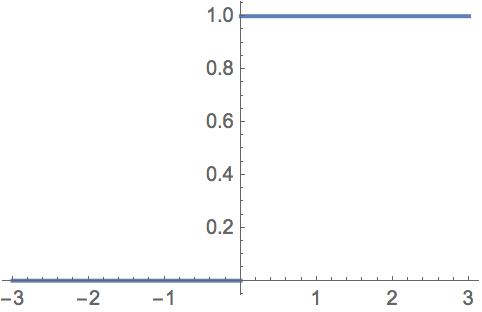

```python
def binary_step(x):
    return 1.0 if x>=0 else 0

res = binary_step(res_4by8)
print(f"Это 8-ка - {bool(res)}")
```
    Это 8-ка - True
```python
res = binary_step(res_8by8)
print(f"Это 8-ка - {bool(res)}")
```
    Это 8-ка - True  

Добавим "смещение" $b$:
```python
b = -45

def predict(x, W, b):
    return binary_step((np.dot(W,x) + b)/ np.linalg.norm(W))

res = predict(x_2, W, b)
print(f"Это 8-ка - {bool(res)}")
```
    Это 8-ка - False
```python
res = predict(x_17, W, b)
print(f"Это 8-ка - {bool(res)}")
```
    Это 8-ка - True  

Верность предсказаний "восьмерок" нашей простой моделью составляет 78% на обучающих данных и 77% на тестовых.

### Полносвязная сеть (Fully Connected)

  
<video src="data/FC.mp4" controls>Your browser does not support the <code>video</code> element.</video>  

[2D Visualization of a Fully-Connected Neural Network](https://adamharley.com/nn_vis/mlp/2d.html)  

**Минусы**:  
- Большое количество параметров.  
- Отсутствие трансляционной инвариантности.  

---

## Нейрон как разделяющая гиперплоскость
Что мы сделали, найдя коллинеарный вектор \( W = \text{avg\_eight} \) и смещение \( b \)?  

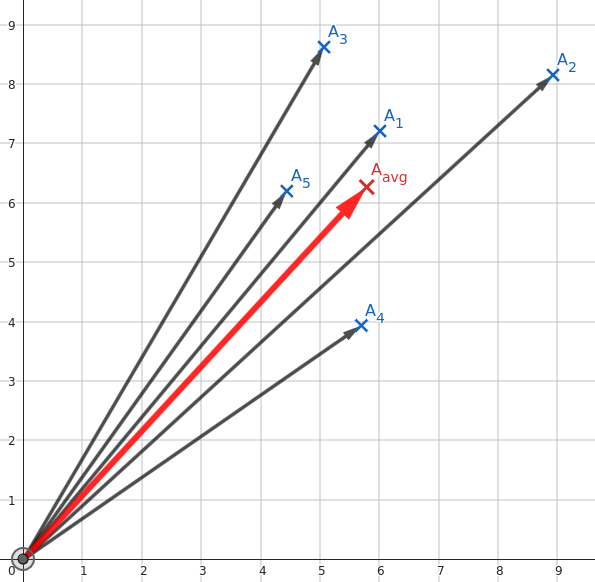  

Прямая линия на плоскости задаётся уравнением:  
\[
x_1 w_1 + x_2 w_2 + b = 0 \quad \text{или} \quad \vec{x}^T \cdot \vec{w} + b = 0
\]  

Где первые два коэффициента \( w_1, w_2 \) задают семейство прямых линий, проходящих через точку (0, 0). Соотношение между \( w_1 \) и \( w_2 \) определяет угол наклона прямой.  
Вектор \( (w_1, w_2) \) — это нормаль к прямой \( w_1 x_1 + w_2 x_2 + b = 0 \):  

Таким образом, наш вектор \( \vec{W} = \text{avg\_eight} \) является нормалью к прямой \( x_1 w_1 + x_2 w_2 + b = 0 \).  

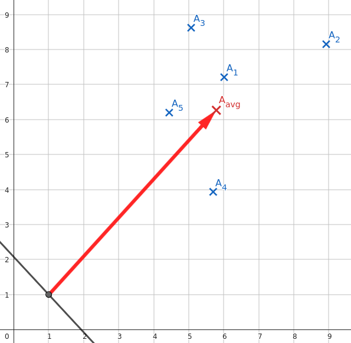  

Все точки \( \vec{x} \), лежащие на этой прямой, при скалярном умножении на \( \vec{w} \) дают 0.  
- Если точка \( \vec{x} \) лежит "над прямой", то результат \( > 0 \).  
- Если точка "под прямой" — \( < 0 \).  

Другими словами:  
\[
\vec{w}^T \cdot \vec{x} + b > 0 \quad \text{— точка лежит «выше» гиперплоскости}
\]  
\[
\vec{w}^T \cdot \vec{x} + b < 0 \quad \text{— точка лежит «ниже» гиперплоскости}
\]  

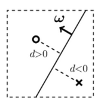  

Расстояние от произвольной точки \( \vec{x} \) до гиперплоскости равно:  
\[
d(\vec{x}) = \frac{\vec{w}^T \cdot \vec{x} + b}{\|\vec{w}\|}
\]  

---

### Нейрон как вычислитель расстояния до гиперплоскости

Нейрон вычисляет расстояние \( d \) от точки с координатами \( \vec{x} = (x_1, \dots, x_n) \) (вектор входов) до гиперплоскости, задаваемой параметрами \( b \) и \( \vec{\omega} = (w_1, \dots, w_n) \):  
- \( \vec{\omega} \) определяет направление нормали гиперплоскости.  
- \( b \) задаёт смещение плоскости вдоль вектора \( \vec{\omega} \).  

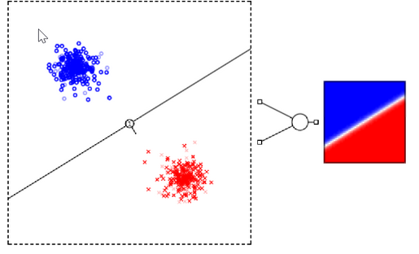  

Если два класса в пространстве признаков разделяются гиперплоскостью, то для их распознавания достаточно одного нейрона.  

Слой, состоящий из трёх нейронов, работает следующим образом: каждый нейрон отделяет "свой класс" от остальных двух.  

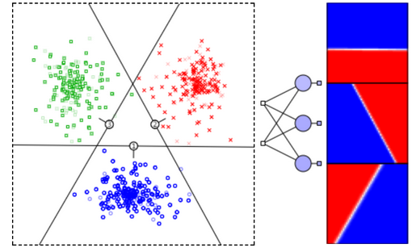  

[Статья Сергея Стёпина, посвящённая нейронным сетям](http://synset.com/ai/ru/nn/NeuralNet_01_Intro.html).


# 11 Занятие
## Зачем нужен скрытый слой?
Перейдём теперь к чуть более сложной задаче. Пусть объекты двух классов (кружочки и крестики) сосредоточены по углам пространства признаков так, как на рисунке. Одной гиперплоскостью (линией) эти два класса разделить нельзя. Иногда такую задачу называют разделяющим ИЛИ (xor). Эта логическая операция равна истине (единице) только, если один из аргументов равен истине, а второй лжи (нулю):   

**Функция XOR**
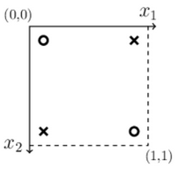
* `(0,0) -> 0`
* `(0,1) -> 1`
* `(1,0) -> 1`
* `(1,1) -> 0`

Чтобы провести классификацию, необходима нейронная сеть с одним скрытым слоем.
Ниже на первом графике (в осях признаков x1 и x2) показаны две гиперплоскости (линии A и B).
Они соответствуют двум скрытым нейронам A и B.
Значения выходов нейронов приведены на втором графике (оси yA и yB). 


Кружок с признаками (0,0) из верхнего левого угла плоскости $x_1, x_2$ даст на выходах нейронов $y_A~0, y_B~1$ (этот объект лежит против вектора нормали плоскости A и по вектору нормали плоскости B).
Второй кружок с признаками (1,1) даст на выходах нейронов значения $y_A~1, y_B~0$.
Получившееся "деформированное" пространство признаков $y_A$ и $y_B$ (второй график) уже легко разделить одной плоскостью C, которая и будет выходным нейроном сети.  

Ниже приведен реальный пример нейронной сети, обученной распознавать два класса объектов, каждый из которых разбивается на два кластера:  

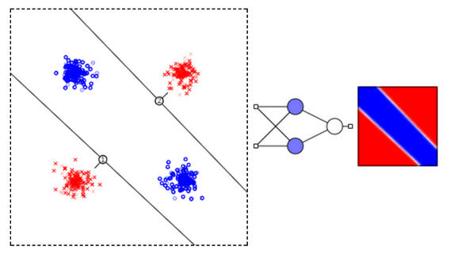

Каждый слой сети преобразует входное пространство признаков в некоторое другое пространство, возможно, с иной размерностью. Такое нелинейное преобразование происходит до тех пор, пока классы не оказываются линейно разделимыми нейронами выходного слоя. 

#### 4 Варианта XOR

Последний ряд картинок - это карты выхода реально обученных нейронных сетей.

## Аппроксимация функции f(x)

При помощи нейронной сети с одним входом, одним выходом и достаточно большим скрытым слоем, можно аппроксимировать любую функцию y=f(x).
Для доказательства, создадим сначала сеть, которая на выходе даёт 1, если вход лежит в диапазоне [a...b] и 0 - в противном случае.

Пусть σ(d) = S(ω·d) - сигмоидная функция, аргумент которой умножен на большое число ω, так что получается прямоугольная ступенька. При помощи двух таких ступенек, можно создать столбик единичной высоты: 

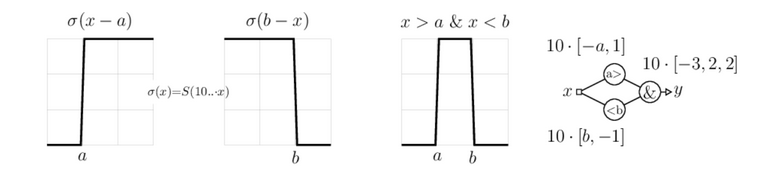

Нормируем аппроксимируемую функцию y=f(x) на интервал [0...1] как для её аргумента x, так и для значения y. Разобъём диапазон изменения x=[0...1] на большое число интервалов (не обязательно равных). На каждом интервале функция должна меняется незначительно. Ниже приведено два таких интервала: 


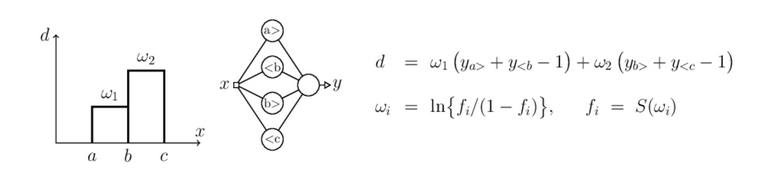


Каждая пара нейронов в скрытом слое реализует единичный столбик. Величина d равна $w_1$, если x∈(a,b) и $w_2$, если x∈(b,с). Если выходной нейрон является линейным сумматором, то можно положить $w_i=f_i$, где $f_i$ - значения функции на каждом интервале. Если же выходной нейрон - обычный нелинейный элемент, то необходимо пересчитать веса $w_i$ при помощи обратной к сигмоиду функции (последняя формула).

#### Аппроксимация функции на Python
```python
import numpy as np                    # библиотека численных методов 
import matplotlib.pyplot as plt       # библиотека рисования графиков


def F(x):                             # эту функцию аппроксимируем
    return np.sin(np.pi*x);
 
n=10                                  # число интервалов
x1 = np.arange(0,   1,     1/n)       # координаты левых границ
x2 = np.arange(1/n, 1+1/n, 1/n)       # координаты правых границ
print("x1:",x1,"\nx2:",x2)            # выводим эти массивы
 
f  = F( (x1+x2)/2 )                   # функция в середине интервала
fi = np.log( f/(1-f) )                # обратные значения к сигмоиду
 
def S(z, z0, s):                      # сигмоид
    return 1/(1+np.exp(-100*s*(z-z0)))
 
def Net(z):                           # выход сети
    return 1/(1+np.exp(-np.dot(fi, S(z, x1, 1) + S(z, x2, -1) -1)))
 
x = np.arange(0.01, 1, 0.01)          # массив x-ов
y = [ Net(z)  for z in x ]            # массив y-ов (выход сети)
 
plt.plot(x, y)                        # результаты работы
plt.plot(x, F(x))                     # исходная функция
plt.show()                            # показываем картинку
```
    x1: [0.  0.1 0.2 0.3 0.4 0.5 0.6 0.7 0.8 0.9] 
    x2: [0.1 0.2 0.3 0.4 0.5 0.6 0.7 0.8 0.9 1. ]

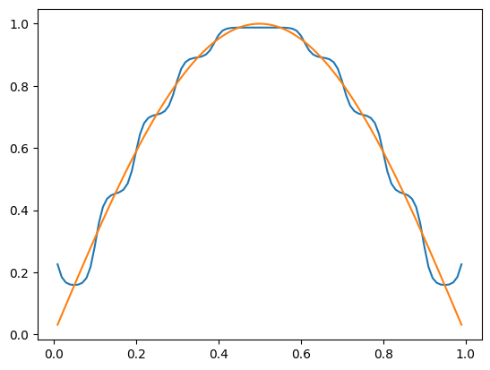


# Задание
0. Нельзя пользоваться фреймворками глубокого обучения - Pytorch, TensorFlow, Keras и т.д.
1. Рассчитать average_digit (матрицу весов) для каждой цифры от 0 до 9, по аналогии с (avg_eight). 
2. Создать десять классификаторов с весами "avg_digit". На вход классификатора подаётся цифра из тестового набора, а на выходе мы получаем 0 или 1, в зависимости от того принадлежит ли цифра нужному классу ('0' - '9'). Добавить смещение (bias).
2. Рассчитать точность каждого классификатора.
3. Объеденить получившиеся классификатоы в одну модель, которая принимает картинку, а выдаёт вектор размера 10. (напр. input=[3], output = [0, 0, 0, 1, 0, 0, 0, 0, 0, 0]).
4. Рассчитать 𝑝𝑟𝑒𝑐𝑖𝑠𝑖𝑜𝑛 и 𝑟𝑒𝑐𝑎𝑙𝑙 получившейся модели на тестовом наборе.
5. Визуализировать набор необработанных данных с помощью алгоритма t-SNE. Взять 30 изображений каждого класса, каждое изображение перевести в вектор размера (784), визуализировать полученные вектора с помощью t-SNE.
6. Визуализировать результаты работы вашей модели (логиты) с помощью алгоритма t-SNE. Прогнать изображения через вашу модель, получившиеся вектора размера (10) визуализировать с помощью t-SNE.

$precision = {TP \over TP + FP} $
$recall = {TP \over TP + FN}$

## Что должно получиться (примерно):
MNIST_images
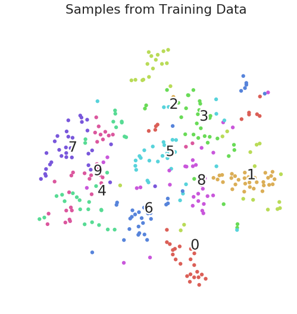
MNIST_embeddings
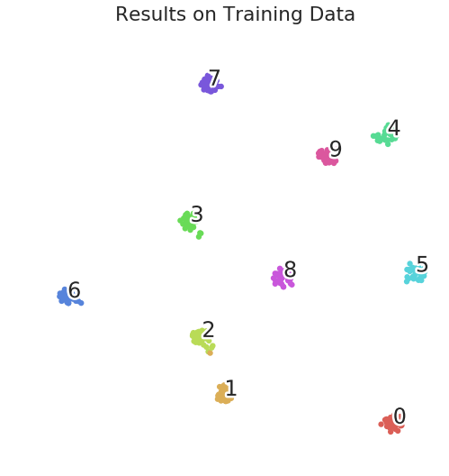

