# Введение Машинное обучение. Часть 2
https://scikit-learn.ru/user_guide/

## Соревнование Kaggle "Titanic: Machine Learning from Disaster"


```python
import pandas as pd
import numpy as np
import matplotlib.pyplot as plt

df_main = pd.read_csv('data/lesson9/train.csv')
df_test = pd.read_csv('data/lesson9/test.csv')
df_main.head()
```
<div>
<table border="1" class="dataframe">
  <thead>
    <tr style="text-align: right;">
      <th></th>
      <th>PassengerId</th>
      <th>Survived</th>
      <th>Pclass</th>
      <th>Name</th>
      <th>Sex</th>
      <th>Age</th>
      <th>SibSp</th>
      <th>Parch</th>
      <th>Ticket</th>
      <th>Fare</th>
      <th>Cabin</th>
      <th>Embarked</th>
    </tr>
  </thead>
  <tbody>
    <tr>
      <th>0</th>
      <td>1</td>
      <td>0</td>
      <td>3</td>
      <td>Braund, Mr. Owen Harris</td>
      <td>male</td>
      <td>22.0</td>
      <td>1</td>
      <td>0</td>
      <td>A/5 21171</td>
      <td>7.2500</td>
      <td>NaN</td>
      <td>S</td>
    </tr>
    <tr>
      <th>1</th>
      <td>2</td>
      <td>1</td>
      <td>1</td>
      <td>Cumings, Mrs. John Bradley (Florence Briggs Th...</td>
      <td>female</td>
      <td>38.0</td>
      <td>1</td>
      <td>0</td>
      <td>PC 17599</td>
      <td>71.2833</td>
      <td>C85</td>
      <td>C</td>
    </tr>
    <tr>
      <th>2</th>
      <td>3</td>
      <td>1</td>
      <td>3</td>
      <td>Heikkinen, Miss. Laina</td>
      <td>female</td>
      <td>26.0</td>
      <td>0</td>
      <td>0</td>
      <td>STON/O2. 3101282</td>
      <td>7.9250</td>
      <td>NaN</td>
      <td>S</td>
    </tr>
    <tr>
      <th>3</th>
      <td>4</td>
      <td>1</td>
      <td>1</td>
      <td>Futrelle, Mrs. Jacques Heath (Lily May Peel)</td>
      <td>female</td>
      <td>35.0</td>
      <td>1</td>
      <td>0</td>
      <td>113803</td>
      <td>53.1000</td>
      <td>C123</td>
      <td>S</td>
    </tr>
    <tr>
      <th>4</th>
      <td>5</td>
      <td>0</td>
      <td>3</td>
      <td>Allen, Mr. William Henry</td>
      <td>male</td>
      <td>35.0</td>
      <td>0</td>
      <td>0</td>
      <td>373450</td>
      <td>8.0500</td>
      <td>NaN</td>
      <td>S</td>
    </tr>
  </tbody>
</table>
</div>


```python
df_prep_x = df_main.drop(['PassengerId', 'Survived', 'Name', 'Ticket', 'Cabin'], axis=1)
df_prep_x_tst = df_test.drop(['PassengerId', 'Name', 'Ticket', 'Cabin'], axis=1)
df_prep_y = df_main['Survived']
```

get_dummies - создаем "индикаторные" переменные 1 или 0, тем самым кодируя данные

sex [male, female, ...] -> sex_male [1, 0, 1, ...], sex_female [0, 1, 0, ...]


```python
def prepare_num(df):
    df_num = df.drop(['Sex', 'Embarked', 'Pclass'], axis=1)
    df_sex = pd.get_dummies(df['Sex'])
    df_emb = pd.get_dummies(df['Embarked'], prefix='Emb')
    df_pcl = pd.get_dummies(df['Pclass'], prefix='Pclass')

    df_num = pd.concat((df_num, df_sex, df_emb, df_pcl), axis=1)
    return df_num

df_prep_x_num = prepare_num(df_prep_x)
df_prep_x_num_tst = prepare_num(df_prep_x_tst)
df_prep_x_num.head()
```
<div>
<table border="1" class="dataframe">
  <thead>
    <tr style="text-align: right;">
      <th></th>
      <th>Age</th>
      <th>SibSp</th>
      <th>Parch</th>
      <th>Fare</th>
      <th>female</th>
      <th>male</th>
      <th>Emb_C</th>
      <th>Emb_Q</th>
      <th>Emb_S</th>
      <th>Pclass_1</th>
      <th>Pclass_2</th>
      <th>Pclass_3</th>
    </tr>
  </thead>
  <tbody>
    <tr>
      <th>0</th>
      <td>22.0</td>
      <td>1</td>
      <td>0</td>
      <td>7.2500</td>
      <td>0</td>
      <td>1</td>
      <td>0</td>
      <td>0</td>
      <td>1</td>
      <td>0</td>
      <td>0</td>
      <td>1</td>
    </tr>
    <tr>
      <th>1</th>
      <td>38.0</td>
      <td>1</td>
      <td>0</td>
      <td>71.2833</td>
      <td>1</td>
      <td>0</td>
      <td>1</td>
      <td>0</td>
      <td>0</td>
      <td>1</td>
      <td>0</td>
      <td>0</td>
    </tr>
    <tr>
      <th>2</th>
      <td>26.0</td>
      <td>0</td>
      <td>0</td>
      <td>7.9250</td>
      <td>1</td>
      <td>0</td>
      <td>0</td>
      <td>0</td>
      <td>1</td>
      <td>0</td>
      <td>0</td>
      <td>1</td>
    </tr>
    <tr>
      <th>3</th>
      <td>35.0</td>
      <td>1</td>
      <td>0</td>
      <td>53.1000</td>
      <td>1</td>
      <td>0</td>
      <td>0</td>
      <td>0</td>
      <td>1</td>
      <td>1</td>
      <td>0</td>
      <td>0</td>
    </tr>
    <tr>
      <th>4</th>
      <td>35.0</td>
      <td>0</td>
      <td>0</td>
      <td>8.0500</td>
      <td>0</td>
      <td>1</td>
      <td>0</td>
      <td>0</td>
      <td>1</td>
      <td>0</td>
      <td>0</td>
      <td>1</td>
    </tr>
  </tbody>
</table>
</div>


```python
# Заполняем пустые значения
df_prep_x_num = df_prep_x_num.fillna(df_prep_x_num.median())
df_prep_x_num_tst = df_prep_x_num_tst.fillna(df_prep_x_num.median())
```

Производим нормализацию (Normalization) данных перед использованием в Модели (Model) Машинного обучения (ML).  
Мы не можем использовать метод fit () для тестового набора данных,поскольку это может привести к смещению тестового набора данных.  
https://stackoverflow.com/questions/23838056/what-is-the-difference-between-transform-and-fit-transform-in-sklearn


```python
from sklearn.preprocessing import MinMaxScaler
scaler = MinMaxScaler()
scaled_x = scaler.fit_transform(df_prep_x_num)
scaled_x_tst = scaler.transform(df_prep_x_num_tst)
```

## Общий синтаксис моделей sklearn
### База
Конструктор с заданием параметров
```python
model = ...
```

Обучение модели (генерации параметров модели обучения из обучающих данных)
```python
model.fit(X_train, y_train)
```
Предсказание результатов
```python
y_predict = model.predict(X_test)
```

### Обучение без учителя

Конструктор с заданием параметров
```python
model = ...
```

Обучение модели
```python
model.fit(X_train)
```
Трансформация данных (параметры, созданные из fit()метода, применяются к модели для создания преобразованного набора данных)
```python
y_predict = model.transform(X_test)
```
Обучение+трансформация данных
```python
y_predict = model.fit_transform(X_train)
```

### Пример:
$Z  = (x -μ )/ σ$

__Fit()__: метод вычисляет параметры μ и σ и сохраняет их как внутренние объекты.
 __Transform()__: метод, использующий эти вычисляемые параметры, применяет преобразование к определенному набору данных.

## Метод главных компонент (PCA)

Метод главных компонент позволяет одновременно избавиться от сильно скоррелированных признаков,
так как вектора базиса пространства, на которое они проецируются, будут ортогональными.  
https://habr.com/ru/company/ods/blog/325654/


```python
from sklearn.decomposition import PCA

model = PCA(n_components=2)
squeezed = model.fit_transform(scaled_x)

plt.figure(figsize=(6, 6))
plt.scatter(squeezed[df_prep_y == 1][:, 0], squeezed[df_prep_y == 1][:, 1], color='green', label='Survived')
plt.scatter(squeezed[df_prep_y == 0][:, 0], squeezed[df_prep_y == 0][:, 1], color='red', marker='x', alpha=0.4,
           label='Not survived')
plt.legend()
plt.show()
```
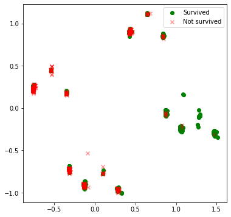
    


## t-SNE
t-SNE (t-distributed Stohastic Neighbor Embedding), метод отображения из многомерного признакового пространства на плоскость (или в 3D), чтобы точки, которые были далеко друг от друга, на плоскости тоже оказались удаленными, а близкие точки – также отобразились на близкие.


```python
from sklearn.manifold import TSNE

model = TSNE(n_components=2)
squeezed = model.fit_transform(scaled_x)

plt.figure(figsize=(6, 6))
plt.scatter(squeezed[df_prep_y == 1][:, 0], squeezed[df_prep_y == 1][:, 1], color='green', label='Survived')
plt.scatter(squeezed[df_prep_y == 0][:, 0], squeezed[df_prep_y == 0][:, 1], color='red', marker='x', alpha=0.4,
           label='Not survived')
plt.legend()
plt.show()
```
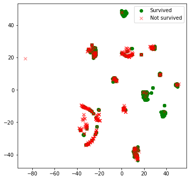
    


## Метод ближайших соседей (k-NN)

Метод k-ближайших соседей (k-nearest neighbors algorithm) — метрический алгоритм для автоматической классификации объектов или регрессии.  

Для классификации каждого из объектов тестовой выборки необходимо последовательно выполнить следующие операции:  
1. Вычислить расстояние до каждого из объектов обучающей выборки
2. Отобрать  объекты обучающей выборки, расстояние до которых минимально
3. Класс классифицируемого объекта — это класс, наиболее часто встречающийся среди ближайших соседей

https://habr.com/ru/company/ods/blog/322534/


```python
# Сгенерируем данные с 2 признаками
np.random.seed(18182)
data_test = np.random.rand(300, 2)
data_train = np.random.rand(1000, 2)
# Обозначим как позитивные данные в радиусе 0.3 от точки (0.5; 0.5)
label_train = (((data_train - 0.5) ** 2).sum(axis=1) < 0.3 ** 2).astype(float)


plt.figure(figsize=(12, 6))
plt.subplot(1, 2, 1)
plt.scatter(data_train[:, 0][label_train == 0], data_train[:, 1][label_train == 0], color='blue')
plt.scatter(data_train[:, 0][label_train == 1], data_train[:, 1][label_train == 1], color='red')
plt.subplot(1, 2, 2)
plt.scatter(data_test[:, 0], data_test[:, 1])
plt.show()
```
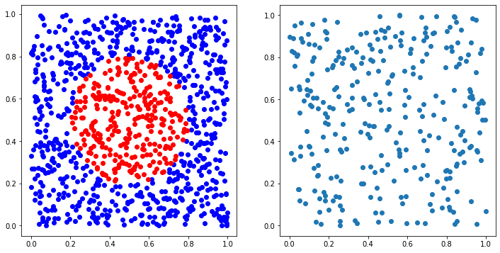
    

```python
from sklearn.neighbors import KNeighborsClassifier
model = KNeighborsClassifier()
model.fit(data_train, label_train)
predict = model.predict(data_test)

plt.figure(figsize=(6, 6))
plt.scatter(data_test[:, 0][predict == 0], data_test[:, 1][predict == 0], color='blue')
plt.scatter(data_test[:, 0][predict == 1], data_test[:, 1][predict == 1], color='red')
# Отрисовка круга происходит через создание фигуры и добавления её на график
circle = plt.Circle((0.5, 0.5), 0.3, color='g', fill=False)
plt.gcf().gca().add_artist(circle)
plt.show()
```
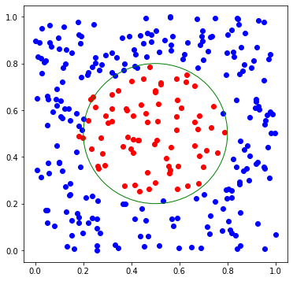


## Дерево решений (Decision Tree)
```python
from sklearn.tree import DecisionTreeClassifier
from sklearn import tree

model = DecisionTreeClassifier(max_depth=3, criterion='entropy')
model.fit(df_prep_x_num, df_prep_y)

plt.figure(figsize=(16, 6))
tree.plot_tree(model, feature_names=df_prep_x_num.columns, filled=True)
plt.show()
```
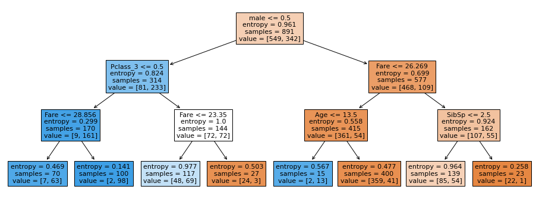
    
## Формулы
### Энтропия (степень хаоса или неопределенности в системе)
$$
S = -{\sum_{n}p_ilog_2p_i}
$$  
n - число классов  
$p_i$ - вероятность i класса
$$
p_0 = {549 \over 891} = 0.6161
$$  

$$
p_1 = {342 \over 891} = 0.3838
$$  

$$
S_0 =  -p_0log_2p_0 - p_1log_2p_1 = 0.9607
$$

### Прирост информации
$$
IG = S_0 - \sum_q{N_i\over N}S_i
$$
q - число групп после разбиения  
$N_i$ – число элементов выборки

$$
IG = 0.9607 - {314\over891}*0.824 - {577\over891}*0.699 = 0.2176
$$

## Важность признаков

```python
importances = model.feature_importances_
features = df_prep_x_num.columns
# Добавление сортировки по важности
indices = np.argsort(importances)

plt.title('Важность признаков')
plt.barh(range(len(indices)), importances[indices], color='b', align='center')
plt.yticks(range(len(indices)), features[indices])
plt.xlabel('Относительная важность')
plt.show()
```
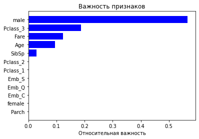
    

```python
model = DecisionTreeClassifier(max_depth=4, criterion='entropy')
model.fit(data_train, label_train)
predict = model.predict(data_test)

plt.figure(figsize=(6, 6))
plt.scatter(data_test[:, 0][predict == 0], data_test[:, 1][predict == 0], color='blue')
plt.scatter(data_test[:, 0][predict == 1], data_test[:, 1][predict == 1], color='red')
# Отрисовка круга происходит через создание фигуры и добавления её на график
circle = plt.Circle((0.5, 0.5), 0.3, color='g', fill=False)
plt.gcf().gca().add_artist(circle)
plt.show()
```
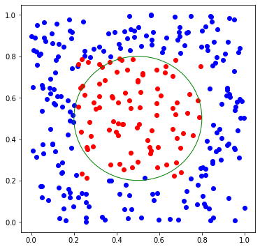
    
```python
plt.figure(figsize=(16, 6))
tree.plot_tree(model, feature_names=['x1', 'x2'], filled=True)
plt.show()
```
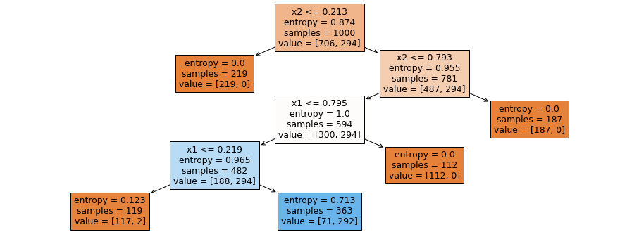
    


## Линейная регрессия
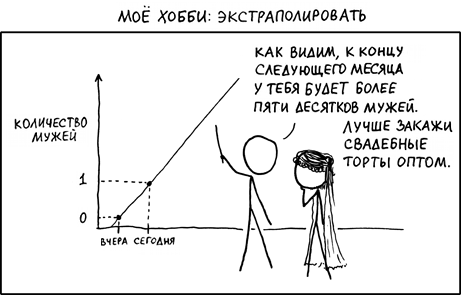

$$
y = w_0 + \sum_{i=1}^m w_ix_i
$$
$$x_0 = 1$$
$$
y = \sum_{i=0}^m w_ix_i
$$
$$
\vec{y} = X \vec{w} + \epsilon
$$

$\vec{y}$ – объясняемая (или целевая) переменная  
$\vec{w}$ – вектор параметров модели (веса)  
X – матрица признаков  
$\epsilon$ –  случайная переменная, соответствующая случайной, непрогнозируемой ошибке модели

## Ошибка модели
Метод наименьших квадратов - минимизация среднеквадратичной ошибки между реальным значением зависимой переменной и прогнозом, выданным моделью:
$$
L(X, \vec{y}, \vec{w}) = {1\over2n}\sum_{i=1}^n(y_i-\vec{w}^T\vec{x}_i)^2 = {1\over2n} ||\vec y - X \vec w||_2^2
$$

$$
{\partial L \over \partial \vec w} = 0
$$

## Регуляризация
w может принимать большие значения, что приведёт к нестабильной оценке параметров модели, т.е. добавление нового наблюдения в набор тренировочных данных приведёт к совершенно другому решению. Одним из способов борьбы с этим является регуляризация.  
Один из вариантов - регуляризация Тихонова:
$$
L(X, \vec{y}, \vec{w}) = {1\over2n} ||\vec y - X \vec w||_2^2 + ||\Gamma \vec w || ^2
$$

$\Gamma$ - матрица Тихонова (коэффициент регуляризации)

https://habr.com/ru/company/ods/blog/323890/


```python
# Пример
df_lr = pd.DataFrame(data={'x':[0.7, 1.3, 2.0, 2.9, 3.4, 5],
                           'y':[0.2, 0.3, 1.1, 1.9, 2.7, 3]})
```


```python
from ipywidgets import interactive

def loss(m, b):
    df_lr['y_pred'] = m*df_lr['x'] + b
    df_lr['loss'] = np.absolute(df_lr['y']-df_lr['y_pred'])
    print('loss =', df_lr['loss'].mean())

def plot(m, b):
    plt.figure(2)
    x = np.linspace(0, 6, num=1000)
    plt.plot(x, m * x + b)
    plt.scatter(x=df_lr['x'], y=df_lr['y'])
    plt.ylim(-0.5, 3.4)
    plt.grid()
    plt.show()
    loss(m, b)

interactive_plot = interactive(plot, m=(-2.0, 2.0), b=(-3, 3, 0.1))
output = interactive_plot.children[-1]
output.layout.height = '350px'
interactive_plot
# Вывод
# interactive(children=(FloatSlider(value=0.0, description='m', max=2.0, min=-2.0), FloatSlider(value=0.0, descr…


from sklearn.linear_model import LinearRegression

model = LinearRegression()
model.fit(df_lr[['x']], df_lr[['y']])
print(f'm = {model.coef_} b = {model.intercept_}') 
```
    'm = [[0.73836012]] b = [-0.34948496]'

## Логистическая регрессия


Линейный классификатор:
$$
a(\vec x) = sign(\vec w^Tx)
$$
sign() - функция, возвращающая знак своего аргумента  
$a(\vec x)$ - ответ классификатора (1 - целевой клас, -1 - отрицательный пример)  

Логистическая регрессия является частным случаем линейного классификатора, но она может выражать вероятность отнесения функции к положительному классу ($p_+$):
$$
p_+ = P(y_i = 1| \vec x_i, \vec w)
$$
P(X) - вероятность события X

$f(\vec x_i, \vec w) = \vec x_i \vec w = 0$ - разделяющая плоскость  
f > 0 - класс "+"  
f < 0 - класс "-"  
f = 0 - неопределённость  

Но данные функции имеют разные пределы:  
$f \in (-\infty ; \infty)$  
$P \in [0 ; 1]$

Введём функцию отношения вероятностей:
$$
OR(X) = {P(X) \over 1 - P(X)}
$$
$OR \in (0 ; \infty)$, а $ln(OR) \in (-\infty ; \infty)$

Таким образом
$log(OR_+) = \vec w^T \vec x_i $ или $OR_+ = e^{\vec w^T \vec x_i }$

$$
p_+ = {OR_+ \over 1 + OR_+} = {e^{\vec w^T \vec x_i } \over 1 + e^{\vec w^T \vec x_i }} = {1 \over 1 + e^{-\vec w^T \vec x_i }} = \sigma(\vec w^T \vec x_i )
$$
$\sigma(x)$ - сигмоид-функция 


Вероятность отнесения функции к отрицательному классу:
$$
p_- = P(y_i = -1| \vec x_i, \vec w) = \sigma(-\vec w^T \vec x_i  )
$$

Обобщение:
$$
P(y = y_i| \vec x_i, \vec w) = \sigma(y_i\vec w^T \vec x_i  )
$$


```python
# Пример
df_lgr = pd.DataFrame(data={'x':[0.7, 1.3, 2.0, 2.9, 3.4, 5],
                            'y':[0., 0., 1., 0., 1., 1]})

def loss_P(m, b):
    # Принцип максимального правдоподобия
    # Стараемся, чтобы "правдоподобия", рассчитанных для каждой точки
    # были максимальны
    df_lgr['y_pred'] = 1/(1 + np.exp(-(m * df_lgr['x'] + b)))
    # События независимы, поэтому их общая вероятность
    # равна произведению П P(y=y_i | x_i,w)
    df_lgr['P'] = df_lgr['y_pred'][df_lgr['y']==1] # вероятность, что y_i = 1
    df_lgr['P'][df_lgr['y']==0] = 1-df_lgr['y_pred']  # вероятность, что y_i = 0
    P=1
    for x in df_lgr['P']:
        P *= x
    print('П P_i =', P)

def loss_log_P(m, b):
    # Принцип максимального правдоподобия
    # Избавимся от произведения вероятностей -> Перейдём к сумме log-ов
    # Необходимо минимизировать выражение:
    df_lgr['y_pred'] = 1/(1 + np.exp(-(m * df_lgr['x'] + b)))
    df_lgr['log_P'] = np.log(df_lgr['y_pred'][df_lgr['y']==1])
    df_lgr['log_P'][df_lgr['y']==0] = np.log(1-df_lgr['y_pred'])
    print('SUM log(P_i) =', df_lgr['log_P'].sum())
    

def plot(m, b):
    plt.figure(2)
    x = np.linspace(0, 6, num=1000)
    plt.plot(x, (1/(1 + np.exp(-(m * x + b)))))
    plt.scatter(x=df_lgr['x'], y=df_lgr['y'])
    plt.ylim(-0.1, 1.2)
    plt.grid()
    plt.show()
    loss_P(m, b)
    loss_log_P(m, b)

interactive_plot = interactive(plot, m=(-1.0, 5.0), b=(-10, 0, 0.1))
output = interactive_plot.children[-1]
output.layout.height = '350px'
interactive_plot
# Ищем Максимум П P
# и минимум log(P)
```
    interactive(children=(FloatSlider(value=2.0, description='m', max=5.0, min=-1.0), FloatSlider(value=-5.0, desc…

```python
from sklearn.linear_model import LogisticRegression
model = LogisticRegression()
model.fit(df_lgr[['x']], df_lgr[['y']])
f'm = {model.coef_} b = {model.intercept_}' 
```
    'm = [[0.77756094]] b = [-1.94751025]'
```python
from sklearn.linear_model import LogisticRegression
model = LogisticRegression(C=0.1, solver='lbfgs')
model.fit(scaled_x, df_prep_y)

y_pred = model.predict(scaled_x_tst)
print('Классы:', y_pred[:4])
y_proba = model.predict_proba(scaled_x_tst)
print('Вероятности:\n', y_proba[:4])
```
    Классы: [0 1 0 0]
    Вероятности:
     [[0.85226449 0.14773551]
     [0.49909854 0.50090146]
     [0.72998682 0.27001318]
     [0.88306963 0.11693037]]

```python
# В данном случае модель не смогла подобрать разделяющую гиперплоскость
model = LogisticRegression(C=0.1, solver='lbfgs')
model.fit(data_train, label_train)
predict = model.predict(data_test)

plt.figure(figsize=(6, 6))
plt.scatter(data_test[:, 0][predict == 0], data_test[:, 1][predict == 0], color='blue')
plt.scatter(data_test[:, 0][predict == 1], data_test[:, 1][predict == 1], color='red')
# Отрисовка круга происходит через создание фигуры и добавления её на график
circle = plt.Circle((0.5, 0.5), 0.3, color='g', fill=False)
plt.gcf().gca().add_artist(circle)
plt.show()
```
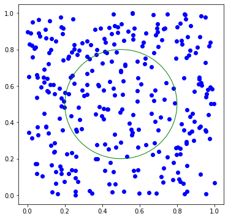
    

## Случайный лес
Алгоритм:
1. Сгенерировать подвыборку из данных
2. Построить решающее дерево  по подвыборке
3. Повторить шаги 1, 2 K раз
4. Результат принимается как результат большинства (классификация) или среднему (регрессия)

```python
from sklearn.ensemble import RandomForestClassifier

model = RandomForestClassifier(n_estimators=20, max_depth=4, criterion='entropy')
model.fit(data_train, label_train)
predict = model.predict(data_test)

plt.figure(figsize=(6, 6))
plt.scatter(data_test[:, 0][predict == 0], data_test[:, 1][predict == 0], color='blue')
plt.scatter(data_test[:, 0][predict == 1], data_test[:, 1][predict == 1], color='red')
# Отрисовка круга происходит через создание фигуры и добавления её на график
circle = plt.Circle((0.5, 0.5), 0.3, color='g', fill=False)
plt.gcf().gca().add_artist(circle)
plt.show()
```
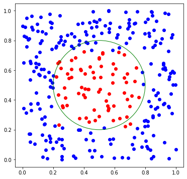
    
## XGBoost
Алгоритм для K шага:
1. Сгенерировать подвыборку из данных
2. Построить решающее дерево  по подвыборке. Целевая величина $y - pred_{K-1}$, где $pred_{K-1}$ - предсказание комбинации прошлых деревьев
3. Добавить новое дерево к имеющемуся результату из комбинации прошлых деревьев так, чтобы минимизировать ошибку


```python
from xgboost import XGBClassifier

model = XGBClassifier(n_estimators=20, max_depth=4)
model.fit(data_train, label_train)
predict = model.predict(data_test)

plt.figure(figsize=(6, 6))
plt.scatter(data_test[:, 0][predict == 0], data_test[:, 1][predict == 0], color='blue')
plt.scatter(data_test[:, 0][predict == 1], data_test[:, 1][predict == 1], color='red')
# Отрисовка круга происходит через создание фигуры и добавления её на график
circle = plt.Circle((0.5, 0.5), 0.3, color='g', fill=False)
plt.gcf().gca().add_artist(circle)
plt.show()
```

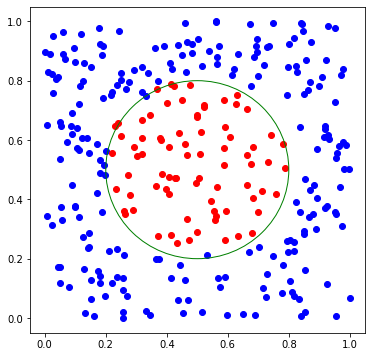
    

## Кластеризация


### K-means
Алгоритм:  
1. Выбирается количество кластеров (k)  
2. Случайным образом выбираются k точек, как центры кластеров  
3. Для всех точек выборки определяется к какому центру они ближе  
4. Переместить центры кластеров в центры выборок  
5. Повторять последние два шага фиксированное число раз, либо до тех пор пока центроиды не "сойдутся" (обычно это значит, что их смещение относительно предыдущего положения не превышает какого-то заранее заданного небольшого значения)

https://www.naftaliharris.com/blog/visualizing-k-means-clustering/


```python
from sklearn.cluster import KMeans

model = KMeans(n_clusters=3)
clusters = model.fit_predict(data_test)

plt.figure(figsize=(6, 6))
for cl in np.unique(clusters):
    data_ = data_test[clusters == cl]
    plt.scatter(data_[:, 0], data_[:, 1])
plt.show()
```
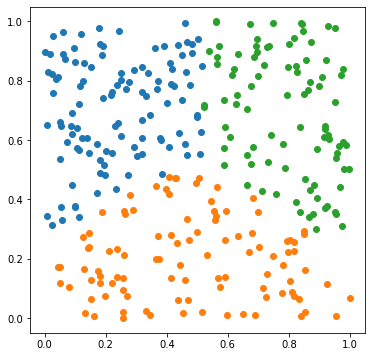
    


### DBSCAN

Алгоритм DBSCAN (Density-based spatial clustering of applications with noise) рассматривает кластеры как области высокой плотности, разделенные областями низкой плотности. Из-за этого довольно общего представления кластеры, найденные DBSCAN, могут иметь любую форму, в отличие от k-means, которые предполагают, что кластеры имеют выпуклую форму.  
Этот алгоритм позволяет выделять произвольное количество кластеров, основываясь на расстоянии между ними. 

https://www.naftaliharris.com/blog/visualizing-dbscan-clustering/


```python
from sklearn.cluster import DBSCAN

model = DBSCAN(eps=0.08, min_samples=1)
clusters = model.fit_predict(data_test)
print(np.unique(clusters).size, 'кластеров')

plt.figure(figsize=(6, 6))
for cl in np.unique(clusters):
    data_ = data_test[clusters == cl]
    plt.scatter(data_[:, 0], data_[:, 1], label='Кластер {}'.format(cl))
plt.legend(loc=2)
plt.show()
```
    6 кластеров
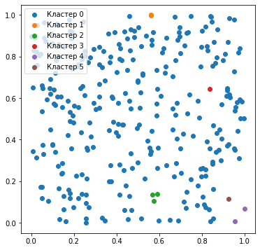
    

# Ресурсы для углублённого изучения темы
* [Открытый курс машинного обучения Open Data Science](https://habr.com/ru/company/ods/blog/322626/)
* [Видеолекции ШАД Воронцова](https://yandexdataschool.ru/edu-process/courses/machine-learning)
* [Классический курс по машинному обучению. Включает в себя как элементы классического ML так и нейронные сети](https://www.coursera.org/learn/machine-learning)
* [Лекции об инструментах, которые нужны, чтобы начать применять ML на практике](https://www.dataschool.io/)


# Задания
1. Разделите данные Титаника (`train.csv`) на тренировочную, валидационную и тестовую часть.
 С помощью валидационной части подберите гиперпараметры для моделей `Random Forest`, `XGBoost`, `Logistic Regression` и `KNN`. 
 Получите точность этих моделей на тестовой части.
2. С помощью RandomForest (`from sklearn.ensemble import RandomForestClassifier`) выберите 2, 4, 8 самых важных признаков и проверьте точность моделей только на этих признаках.

# Лабораторная работа 9. Титаник ML
Для выполнения лабораторной работы необходимо скачать подготовленный [файл](./data/titanic_prepared.csv).  
Необходимо использовать **именно этот** файл, а не из *Лабораторной #5*, так как в нём другие значения столбца `label`.


## Лабораторная 9.1
1. Загрузить файл, разделить его на train и test. Для test взять 10% случайно выбранных строк таблицы.
2. Обучить модели: Decision Tree, XGBoost, Logistic Regression из библиотек sklearn и xgboost. Обучить модели предсказывать столбец label по остальным столбцам таблицы.
3. Наладить замер Accuracy - доли верно угаданных ответов.
4. Точности всех моделей не должны быть ниже 85%
5. С помощью Decision Tree выбрать 2 самых важных признака и проверить точность модели, обученной только на них.

## Лабораторная 9.2
1. Лабораторная 9.1 пункты 1-5.
2. Реализовать случайный лес в виде класса MyRandomForest. В реализации разрешается использовать DecisionTreeClassifier из библиотеки sklearn. Класс должен иметь методы fit и predict по аналогии с остальными классами библиотеки sklearn.  
    Алгоритм построения Случайного леса изложен на [Википедии](https://ru.wikipedia.org/wiki/Random_forest)  
    Необходимо обратить внимание что при построения леса используются не все доступные признаки для каждого узла дерева. А так же что в sklearn это регулируется параметрами DecisionTreeClassifier.
3. Продемонстрировать, что точность леса выше чем точность одного решающего дерева.

