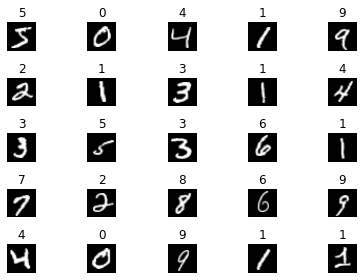
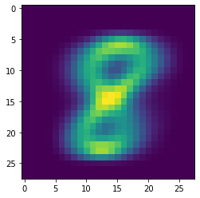
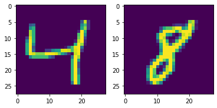

# 10 Занятие. Перцептрон

## Что такое нейронная сеть
**Нейронная сеть** — это последовательность нейронов, соединенных между собой синапсами. Структура нейронной сети пришла в мир программирования прямиком из биологии. Благодаря такой структуре, машина обретает способность анализировать и даже запоминать различную информацию. Нейронные сети также способны не только анализировать входящую информацию, но и воспроизводить ее из своей памяти.  

**Аксон** — длинный отросток нейрона. Приспособлен для проведения возбуждения и информации от тела нейрона к нейрону или от нейрона к исполнительному органу.  
**Дендриты** — короткие и сильно разветвлённые отростки нейрона, служащие главным местом для образования влияющих на нейрон возбуждающих и тормозных синапсов (разные нейроны имеют различное соотношение длины аксона и дендритов), и которые передают возбуждение к телу нейрона. 

### Синапс нейронной сети


## Перцептрон


$A$ - входящий вектор признаков  
$W$ - веса модели  
$b = w_0$ - сдвиг модели   
$y$ - результат модели  
$\sigma$ - функция активации

**<center>Смещение</center>**
$$
A_0 = 1
$$
$$
S = \sum_{i=0}^nA_iw_i
$$

X = [x1, x2, x3]; 
W = [w1, w2, w3]; 
$ b = w_0 $
$$
\vec x * \vec W = w_0 + x_1w_1 + x_2w_2 + x_3w_3
$$


## Использование набора данных MNIST в Python
База данных MNIST (сокращение от «Modified National Institute of Standards and Technology») — это набор образцов рукописного написания цифр. 
Является стандартом для калибрации и сопоставления методов распознавания изображений,
с помощью машинного обучения, в первую очередь на основе нейронных сетей.  

### Знакомство
```python
# Importing the necessary libraries
import numpy as np
import matplotlib.pyplot as plt
import torchvision
plt.rcParams['figure.figsize'] = 10, 10
```
Функция стандартизированного изменения изображений
```python
transform = torchvision.transforms.Compose([
                    torchvision.transforms.ToTensor(),
                    torchvision.transforms.Normalize((0.5), (0.5))
                                            ])
```
Назначение переменных использования набора
```python
train_dataset = torchvision.datasets.MNIST(
    root="./MNIST/train", train=True,
    transform=torchvision.transforms.ToTensor(),
    download=False)

test_dataset = torchvision.datasets.MNIST(
    root="./MNIST/test", train=False,
    transform=torchvision.transforms.ToTensor(),
    download=False)
```
Рассмотрим 25 случайных изображений из набора 
```python
# Создаём номера выборки
random_samples = np.random.randint(1, len(train_dataset), (25))

# Раскладываем выборку на холсте
for idx in range(random_samples.shape[0]):
    plt.subplot(5, 5, idx + 1)
    plt.imshow(train_dataset[idx][0][0].numpy(), cmap='gray')
    plt.title(train_dataset[idx][1])
    plt.axis('off')

# Смотрим получившийся холст
plt.tight_layout()
plt.show()
```
  
Элемент `train_dataset[0]` это `(Img, label)`.

### Трансформация в удобоваримый вид
Определение инструментов
```python
def encode_label(j):
	"""
	Переводит число-признак в матрицу:
	5 -> [[0], [0], [0], [0], [0], [1], [0], [0], [0], [0]]
	       0,   1,   2,   3,   4,   5,   6,   7,   8,   9.  
	"""
	
	e = np.zeros((10,1))
	e[j] = 1.0
	return e

def shape_data(data):
	features = [np.reshape(x[0][0].numpy(), (784,1)) for x in data]
	labels = [encode_label(y[1]) for y in data]
	return zip(features, labels)


train = shape_data(train_dataset)
test = shape_data(test_dataset)
```
Проверка
```python
train = list(train)
test = list(test)
print('train imgs -', len(train))
print('test imgs -', len(test))
```
    train imgs - 60000
    test imgs - 10000

## Перцептрон в Python
### Теория
Для обучения перцептрона для распознавания цифр можно использовать следующий подход:  
* Для каждой цифры хранится среднее представление в виде матрицы.
* Подбирается такой вектор весов $W$, чтобы скалярное произведение вектора, представляющего изображение цифры, с этим вектором давало наибольшее значение.  

  
Где $V$ - это вектор изображения, $W$ - веса нейросети.  

Рассмотрим среднее  представление  цифры  8 (`avg_eight`):
```python
def average_digit(data, digit):
    filtered_data = [x[0] for x in data if np.argmax(x[1]) == digit]
    filtered_array = np.asarray(filtered_data)
    return np.average(filtered_array, axis=0)

avg_eight = average_digit(train, 8)

img = (np.reshape(avg_eight, (28, 28)))
plt.imshow(img)
plt.show()
```
  

Это изображение из обучающего набора MNIST содержит большое количество информации о том, какими общими свойствами должны обладать изображения цифры 8.
Мы используем `avg_eight` в качестве параметров простой модели, чтобы определить, является ли данный входной вектор $x$, представляющий изображение цифры, изображением восьмёрки.
В данном случае `avg_eight` выступает в качестве весов.  

```python
# train[ indx ][ img/label ]
x_2 = train[2][0] # 4-ка
x_17 = train[17][0] # 8-ка

img_2 = (np.reshape(x_2, (28, 28)))
img_17 = (np.reshape(x_17, (28, 28)))

plt.subplot(1, 2, 1)
plt.imshow(img_2)
plt.subplot(1, 2, 2)
plt.imshow(img_17)
plt.show()
```


Вычислим скалярное произведение W и x, т. е. попарно перемножим значения W и x и суммируем все 784 результирующих значения.
Если наша гипотеза верна и x соответствует 8,
то более темные пиксели должны располагаться примерно в тех же местах, что и в случае W, и наоборот.
Если же х не соответствует 8, то совпадений должно быть меньше.
Давайте проверим эту гипотезу на нескольких примерах.

```python
W = np.transpose(avg_eight)

res_4by8 = np.dot(W, x_2)[0][0] / np.linalg.norm(W)
print(res_4by8) 
```
    2.7090142
```python
res_8by8 = np.dot(W, x_17)[0][0] / np.linalg.norm(W)
print(res_8by8)
```
    7.351549

### Функция активации перцептрона
Для автоматизации определения используется **ступенчатая функция активации (binary step function)**:  
F(x)={1,если x≥0,0,если x<0.  
  
\begin{equation}
    \begin{matrix}
    {F(x)} & =
    & \left\{
    \begin{matrix}
    1 &  \mbox{if } x \geq 0  \\
    0 &  \mbox{if } x < 0 & 
    \end{matrix} \right.
    \end{matrix}
\end{equation}


```python
def binary_step(x):
    return 1.0 if x>=0 else 0

res = binary_step(res_4by8)
print(f"Это 8-ка - {bool(res)}")
```
    Это 8-ка - True
```python
res = binary_step(res_8by8)
print(f"Это 8-ка - {bool(res)}")
```
    Это 8-ка - True  

Добавим "смещение" $b$:
```python
b = -45

def predict(x, W, b):
    return binary_step((np.dot(W,x) + b)/ np.linalg.norm(W))

res = predict(x_2, W, b)
print(f"Это 8-ка - {bool(res)}")
```
    Это 8-ка - False
```python
res = predict(x_17, W, b)
print(f"Это 8-ка - {bool(res)}")
```
    Это 8-ка - True  

Верность предсказаний "восьмерок" нашей простой моделью составляет 78% на обучающих данных и 77% на тестовых.

### Полносвязная сеть (Fully Connected)

  
<video src="data/FC.mp4" controls>Your browser does not support the <code>video</code> element.</video>  

[2D Visualization of a Fully-Connected Neural Network](https://adamharley.com/nn_vis/mlp/2d.html)  

**Минусы**:  
- Большое количество параметров.  
- Отсутствие трансляционной инвариантности.  

---

## Нейрон как разделяющая гиперплоскость
Что мы сделали, найдя коллинеарный вектор \( W = \text{avg\_eight} \) и смещение \( b \)?  

  

Прямая линия на плоскости задаётся уравнением:  
\[
x_1 w_1 + x_2 w_2 + b = 0 \quad \text{или} \quad \vec{x}^T \cdot \vec{w} + b = 0
\]  

Где первые два коэффициента \( w_1, w_2 \) задают семейство прямых линий, проходящих через точку (0, 0). Соотношение между \( w_1 \) и \( w_2 \) определяет угол наклона прямой.  
Вектор \( (w_1, w_2) \) — это нормаль к прямой \( w_1 x_1 + w_2 x_2 + b = 0 \):  

Таким образом, наш вектор \( \vec{W} = \text{avg\_eight} \) является нормалью к прямой \( x_1 w_1 + x_2 w_2 + b = 0 \).  

  

Все точки \( \vec{x} \), лежащие на этой прямой, при скалярном умножении на \( \vec{w} \) дают 0.  
- Если точка \( \vec{x} \) лежит "над прямой", то результат \( > 0 \).  
- Если точка "под прямой" — \( < 0 \).  

Другими словами:  
\[
\vec{w}^T \cdot \vec{x} + b > 0 \quad \text{— точка лежит «выше» гиперплоскости}
\]  
\[
\vec{w}^T \cdot \vec{x} + b < 0 \quad \text{— точка лежит «ниже» гиперплоскости}
\]  

  

Расстояние от произвольной точки \( \vec{x} \) до гиперплоскости равно:  
\[
d(\vec{x}) = \frac{\vec{w}^T \cdot \vec{x} + b}{\|\vec{w}\|}
\]  

---

### Нейрон как вычислитель расстояния до гиперплоскости

Нейрон вычисляет расстояние \( d \) от точки с координатами \( \vec{x} = (x_1, \dots, x_n) \) (вектор входов) до гиперплоскости, задаваемой параметрами \( b \) и \( \vec{\omega} = (w_1, \dots, w_n) \):  
- \( \vec{\omega} \) определяет направление нормали гиперплоскости.  
- \( b \) задаёт смещение плоскости вдоль вектора \( \vec{\omega} \).  

  

Если два класса в пространстве признаков разделяются гиперплоскостью, то для их распознавания достаточно одного нейрона.  

Слой, состоящий из трёх нейронов, работает следующим образом: каждый нейрон отделяет "свой класс" от остальных двух.  

  

[Статья Сергея Стёпина, посвящённая нейронным сетям](http://synset.com/ai/ru/nn/NeuralNet_01_Intro.html).


# Задание
0. Нельзя пользоваться фреймворками глубокого обучения - Pytorch, TensorFlow, Keras и т.д.
1. Рассчитать average_digit (матрицу весов) для каждой цифры от 0 до 9, по аналогии с (avg_eight). 
2. Создать десять классификаторов с весами "avg_digit". На вход классификатора подаётся цифра из тестового набора, а на выходе мы получаем 0 или 1, в зависимости от того принадлежит ли цифра нужному классу ('0' - '9'). Добавить смещение (bias).
2. Рассчитать точность каждого классификатора.
3. Объеденить получившиеся классификатоы в одну модель, которая принимает картинку, а выдаёт вектор размера 10. (напр. input=[3], output = [0, 0, 0, 1, 0, 0, 0, 0, 0, 0]).
4. Рассчитать 𝑝𝑟𝑒𝑐𝑖𝑠𝑖𝑜𝑛 и 𝑟𝑒𝑐𝑎𝑙𝑙 получившейся модели на тестовом наборе.
5. Визуализировать набор необработанных данных с помощью алгоритма t-SNE. Взять 30 изображений каждого класса, каждое изображение перевести в вектор размера (784), визуализировать полученные вектора с помощью t-SNE.
6. Визуализировать результаты работы вашей модели (логиты) с помощью алгоритма t-SNE. Прогнать изображения через вашу модель, получившиеся вектора размера (10) визуализировать с помощью t-SNE.

$precision = {TP \over TP + FP} $
$recall = {TP \over TP + FN}$

## Что должно получиться (примерно):
MNIST_images

MNIST_embeddings


