# Обучение нейронных сетей

### Один нейрон

Напомним, что нейрон с $n$ входами характеризуется $n+1$ параметром: вектором нормали к разделяющей гиперплоскости $ω={ω_1,...,ω_n}$ и её сдвигом $ω_0$. Расстояние $d$ от вектора входа $x$ к гиперплоскости равно: $$ d=ω_0+ω_1x_1+...+ω_nx_n=ω_0+ωx=\sum_{i=0}^nω_ix_i. $$ 
$$x_0 = 1 $$

На выходе нейрона $y$ расстояние $d$ нормируется на диапазон [0...1] (прогоняется через активационную функцию "S"): $$ y = y(ω,x) = S(d) = S(\sum_{i=0}^nω_ix_i)$$ $$S(d)={1 \over 1+e^{−d}}$$

Производную сигмоидной функции можно выразить через значение выхода нейрона: $$ S'(d) = {e^{−d} \over (1 + e^{-d})^2} = S(d)(1−S(d)) =y(1−y). $$

Пусть на вход нейрона подаётся вектор **x**, в результате чего на выходе получется значение **y**. И пусть на самом деле значению **x** должен соответствовать выход **Y**. Определим ошибку "работы нейрона", как среднеквадратичное отклонение желаемого выхода от фактического: $$ E^2=(Y−y(ω,x))^2.$$ **Задача обучения нейрона состоит в минимизации этой ошибки.**

### Градиентный спуск

Вычислим градиент ошибки. Он направлен в сторону её максимального роста (в обратном направлении ошибка убывает):
$${∂E^2 \over ∂ω_i} = {∂E^2 \over ∂y}⋅{∂y \over ∂d}⋅{∂d \over∂ω_i} = −2(Y−y)⋅y(1−y)⋅x_i$$

где учтена производная сигмоидной функции (1). Таким образом, вектор нормали $ω$ и смещение необходимо сдвинуть против градиента на величины: 
$$ \delta ω = 2 \lambda (Y−y)y(1−y)x$$
$$ \delta ω_0 = 2  \lambda (Y−y)y(1−y) - смещение$$

где абсолютную величину сдвига (шаг) задаёт параметр $\lambda$.

Геометрический смысл этих формул прост. Пусть $Y=1$, а нейрон выдаёт $y≪1$. Тогда вектор нормали (и плоскость) повернётся в сторону примера $x$, а $ω_0$ увеличится, т.е. плоскость сдвинется в противоположную от входа сторону. Когда $Y=0$, а $y∼1$, множитель Y−y становится отрицательным и всё произойдёт с точностью до наоборот.

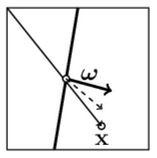

### Многомерный случай

Обозначим набор параметров модели вектором $w$. Ошибка является их функцией $L=L(w)$. В пространстве параметров существуют поверхности постоянного значения $L(w)=const$. Смещение $dw$ вдоль таких поверхностей не меняет $L$ и, следовательно, её диффернциал равен нулю:

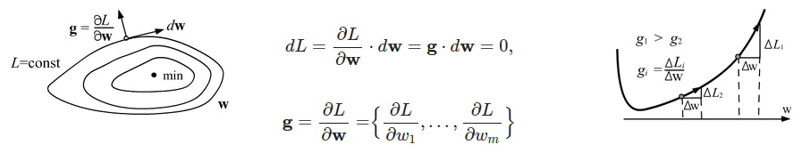


Такими образом, вектор градиента $g$ перпендикулярен поверхностям $L=const$ и направлен в сторону увеличения $L$ (как и любая производная). При приближении к минимуму длина градиента, обычно уменьшается, а в точке минимума (экстремум) она равна нулю (выше второй рисунок).

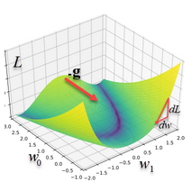

Чтобы найти минимум $L$, необходимо двигаться в обратном к градиенту направлении (вдоль антиградиента), с шагом пропорциональным некоторому числу $\lambda$. 

Этот гиперпараметр называется скоростью обучения:
$$ w^{t+1} = w^t − λ g^t $$
$$ g^t = {∂L \over∂w^t}$$

Чем больше скорость обучения λ, тем быстрее параметры модели приближаются к оптимальным значениям. Однако при больших λ существует риск проскочить минимум (несмотря на уменьшение длины градиента в его окрестности).

## Метод Обратного Распространения

#### https://habr.com/ru/articles/313216/


Ошибка выходного нейрона
$$
\delta_{output} = (out_{pred} - out_{y})f'(in)
$$
Ошибка внутренного нейрона
$$
\delta_{hid} = f'(in)\sum_i(w_i\delta_i)
$$
Градиент ошибки нейрона
$$
grad_a^b = out_a*\delta_b
$$
Изменение весов
$$
\Delta w_t = E*grad_a^b+\alpha*\Delta w_{t-1}
$$

*E* - скорость обучения  
$\alpha$ - момент

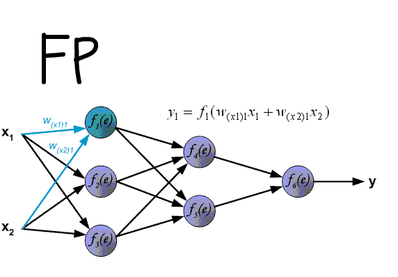

Ошибка выходного нейрона
$$
\delta_{6} = (out_{pred} - out_{y})f'(in)
$$

Производная от функции активации
$$
\sigma(in)' = \sigma(in) * (1 - \sigma(in))
$$

Ошибка внутренного нейрона No5 ($\delta_{5}$)
$$
\delta_{5} = \sigma(in)' * w_{56} * \delta_{6} = \sigma(in)(1 - \sigma(in)) * w_{56} * \delta_{6} = out_{y} (1 - out_{y}) * w_{56} * \delta_{6}
$$

Градиент ошибки нейрона No5 
$$
grad_6^5 = \delta_{5} * f_{5}(in)
$$

Изменение весов
$$
w_{56} = w_{56} - \lambda *grad_5^6
$$

$\lambda$ - скорость обучения  
$\alpha$ - момент


### Значение момента


# Полносвязная неронная сеть


Схема простой нейросети. Зелёным цветом обозначены входные нейроны, голубым — скрытые нейроны, жёлтым — выходной нейрон

$$
\vec {h_t} = W_h \vec x
$$

$$
\vec h = F_h(\vec{h_t})
$$

$$
\vec {y_t} = W_y \vec h
$$

$$
\vec y = F_y(\vec{y_t})
$$


# Функци активации
## Сигмоида
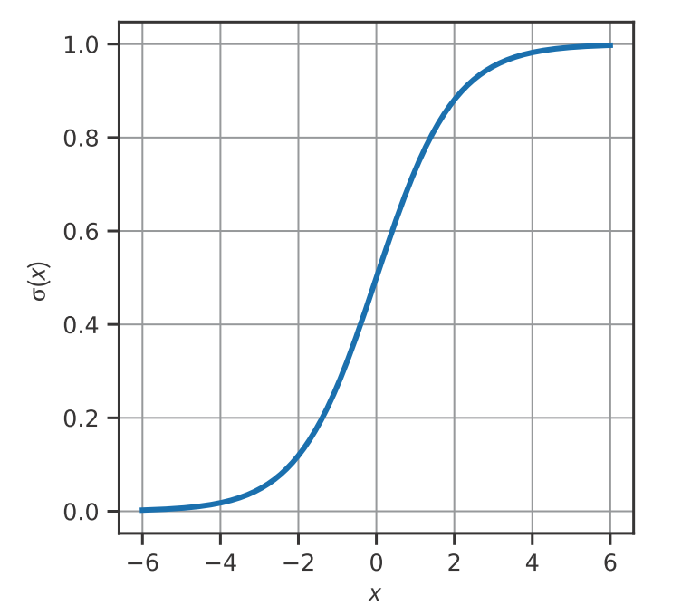

$
F(x) = {1 \over 1 + e^{-x}}
$

## Гиперболический тангенс
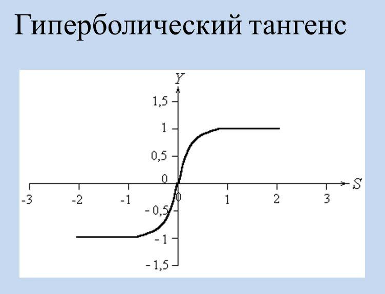

$
F(x) = {e^{2x}-1 \over e^{2x}+1}
$

## ReLU (rectified linear unit)
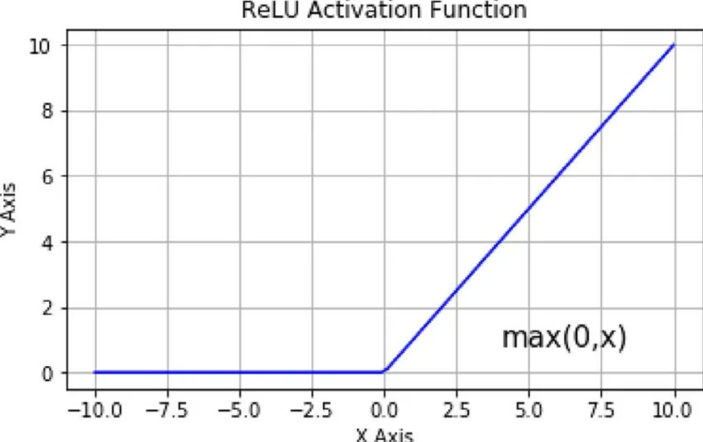

$
F(x) = max(0, x)
$

# Softmax

Применяется в тех случаях, когда необходимо, чтобы сумма элементов была равно 1, а каждый элемент принадлежал интервалу \[0; 1\] (для задач классификации)


$
F(x) = {e^{x} \over \sum_j e^{x_j}}
$

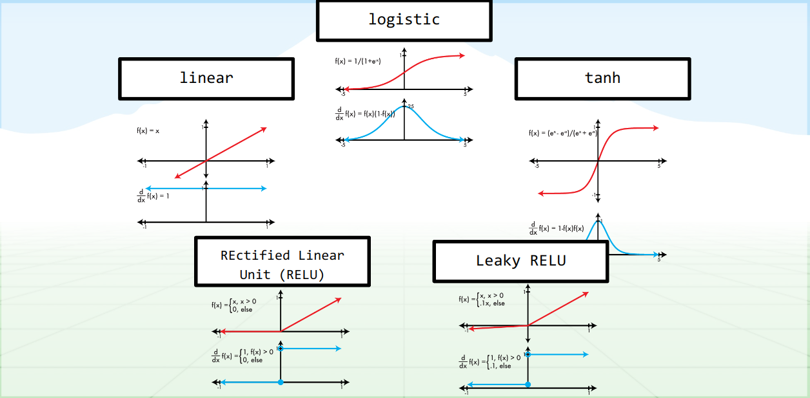
Скорость обучения logistic-ой функции активации низкая с определенного момента (x > 3)

# Функция потерь
### Регрессия
**Средняя абсолютная ошибка**
$$
MAE = {1\over n}\sum_{i=1}^n|y_i - pred_i|
$$
*n - число признаков в выходном векторе*  
*pred - предсказанный вектор*

**Средняя квадратичная ошибка**
$$
MSE = {1\over n}\sum_{i=1}^n(y_i - pred_i)^2
$$
**Средняя абсолютная процентная ошибка**
$$
MAPE = {100\% \over n}\sum_{i=1}^n{|y_i - pred_i|\over y_i}
$$


```python
#!pip install scikit-learn
import numpy as np
from sklearn.metrics import mean_absolute_error, mean_squared_error, log_loss
```


```python
# MAE
def mean_absolute_error(y, pred):
	diff = y - pred # находим разницу между  наблюдаемыми значениями (y) и прогнозируемыми (pred)
	abs_diff = np.absolute(diff) # находим абсолютную разность между прогнозами и фактическими наблюдениями.
	mean_diff = abs_diff.mean() # находим среднее значение
	return mean_diff

y = np.array([1.1,2,1.7]) # создаем список актуальных значений
pred = np.array([1,1.7,1.5]) # список прогнозируемых значений

# mean_absolute_error(y, pred) # sklearn
mean_absolute_error(y, pred)
```


	0.20000000000000004


```python
# MSE
def mean_squared_error(y, pred):
	diff = y - pred # находим разницу между  наблюдаемыми значениями (y) и прогнозируемыми (pred)
	differences_squared = diff ** 2 # возводим в квадрат (чтобы избавиться от отрицательных значений)
	mean_diff = differences_squared.mean() # находим среднее значение

	return mean_diff

y = np.array([1.1,2,1.7]) 
pred = np.array([1,1.7,1.5]) 

# mean_squared_error(y, pred) # sklearn
mean_squared_error(y, pred)
```


	0.04666666666666667


```python
# RMSE
def root_mean_squared_error(y, pred):
	diff = y - pred # находим разницу между  наблюдаемыми значениями (y) и прогнозируемыми (pred)
	differences_squared = diff ** 2 # возводим в квадрат
	mean_diff = differences_squared.mean() # находим среднее значение
	rmse_val = np.sqrt(mean_diff) # извлекаем квадратный корень
	return rmse_val

y = np.array([1.1,2,1.7])
pred = np.array([1,1.7,1.5])

# mean_squared_error(y, pred, squared = False) #Если установлено значение False, функция возвращает значение RMSE.
root_mean_squared_error(y, pred)
```


	0.21602468994692867


### Классификация
**Бинарная кросс энтропия**
$$
CE = -y_1log(pred_1)-(1-y_1)log(1-pred_1)
$$
**Категориальная кросс энтропия**
$$
CE = -\sum_j^Cy_jlog(pred_j)
$$
*C - число классов*


```python
def binary_cross_entropy(y, pred):
	y = np.array([1 if el == "Cat" else 0 for el in y]) # [[0 1 1 0]]
	pred = np.array([el[0] for el in pred])
	CE = -y*np.log(pred) - (1 - y)*np.log((1-pred))
	return CE.mean()

labels = {"Cat": [1, 0], "Dog":[0,1]}

def encode_label(y):
	return np.array([labels[key] for key in y])

def cross_entropy(y, pred):
	y = encode_label(y) # [[0, 1], [1, 0], [1, 0], [0, 1]]
	pred = np.array(pred)
	CE = -np.sum(y*np.log(pred), axis=-1)
	return CE.mean()

y = ["Dog", "Cat", "Cat", "Dog"] # список правильных меток классов
pred = [[.1, .9], [.9, .1], [.8, .2], [.35, .65]] # [P(dog), P(cat)] # список вероятностей, предсказанных моделью.

# (Первый аргумент в вызове функции — это список правильных меток классов для каждого входа. Второй аргумент — это список вероятностей, предсказанных моделью.)
# log_loss(y, pred) # sklearn 
cross_entropy(y, pred) # binary_cross_entropy(y, pred)
```


	0.21616187468057912


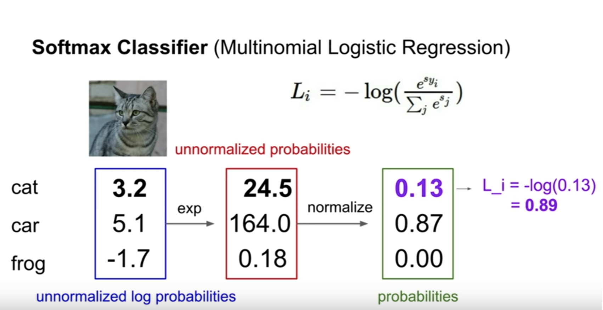


```python

```

# Граф вычислений
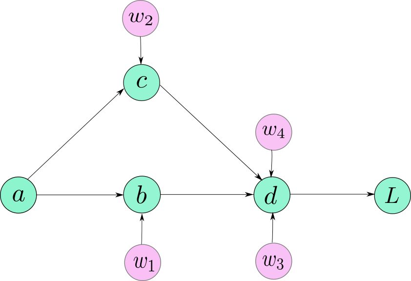

# Обратное распространение ошибки. Пример

- функция:
$$f(x,w) = 1 + e^{w_1x+w_0}$$
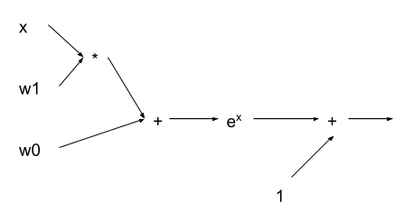

- Начальное состояение весов и входного значения:
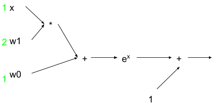

- Посчитаем значения по прямому проходу
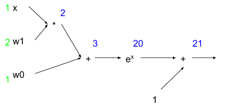

- Для удобства обозначим узлы (подфункции)
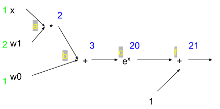

- Обратное распространение. Пусть df = 1. Тогда 
$$dc = {df \over dc}df = (c+1)'_{c} * 1 = 1$$
$$db = {dc \over db}dc = (e^b)'_{b} * 1 = e^3 = 20$$
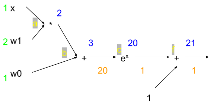

$$dw_0 = {db \over dw_0}db = (a+w_0)'_{w_0} * 20 = 20$$
$$da = {db \over da}db = (a+w_0)'_{a} * 20 = 20$$
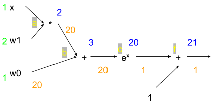

$$dw_1 = {da \over dw_1}da = (x*w_1)'_{w_1} * 20 = x*20 = 20$$
$$dx = {da \over dx}da = (x*w_1)'_{x} * 20 = w_1*20 = 40$$
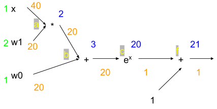

# Обратное распространение ошибки. Пример с матрицами

$$f={1 \over 2} ||X*W||^2_2$$
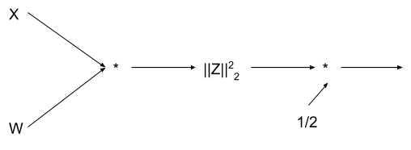

- Начальное состояение весов и входного значения
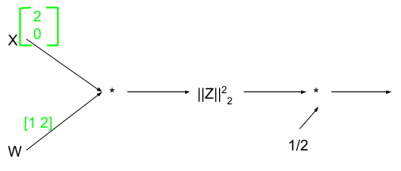

- Посчитаем значения по прямому проходу
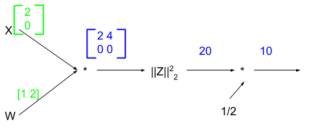

- Для удобства обозначим узлы (подфункции)  
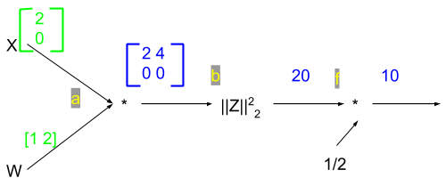

- Обратное распространение. Пусть df = 1. Тогда 
$$db = {df \over db}df = ({1 \over 2}b)'_{b} * 1 = 0.5$$
$$da_{ij} = {db \over da_{ij}}db = (a_{ij}^2)'_{a_{ij}} * 0.5 = a_{ij} $$
или $$\nabla_a f = a$$
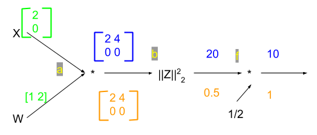

$$\nabla_w f = X^T \nabla_a f$$

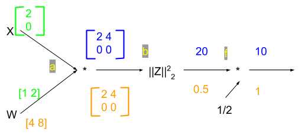

# Переобучение
**Недообучение** — нежелательное явление, возникающее при решении задач обучения по прецедентам, когда алгоритм обучения не обеспечивает достаточно малой величины средней ошибки на обучающей выборке. Недообучение возникает при использовании недостаточно сложных моделей.

**Переобучение** (overtraining, overfitting) — нежелательное явление, возникающее при решении задач обучения по прецедентам, когда вероятность ошибки обученного алгоритма на объектах тестовой выборки оказывается существенно выше, чем средняя ошибка на обучающей выборке. Переобучение возникает при использовании избыточно сложных моделей.
img src="images/LessonsII/Overfitting.svg.png" width=80% height=80% />

### Процесс обучения
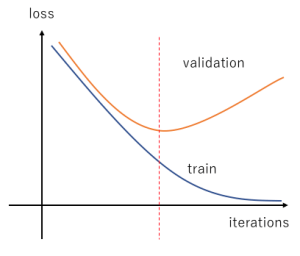

### Возможные решения при переобучении:
* Увеличение количества данных в наборе;
* Уменьшение количества параметров модели (количество параметров модели (весов) была в 2 - 3 раза меньше числа примеров обучающего множества);
* Добавление регуляризации / увеличение коэффициента регуляризации.

### Возможные решения при недообучении:
* Добавление новых параметров модели;
* Использование для описания модели функций с более высокой степенью;
* Уменьшение коэффициента регуляризации.

# Аугментация данных

**Аугментация данных** (data augmentation) – это методика создания дополнительных обучающих данных из имеющихся данных. Для достижения хороших результатов глубокие сети должны обучаться на очень большом объеме данных. Следовательно, если исходный обучающий набор содержит ограниченное количество изображений, необходимо выполнить аугментацию, чтобы улучшить результаты модели.

Можно использовать следующие искажения:
* Геометрические (афинные, проективные, ...);
* Яркостные/цветовые;
* Замена фона;
* Искажения, характерные для решаемой задачи: блики, шумы, размытие и т. д.

# Обучение с подкреплением
Обучение с подкреплением — это метод машинного обучения, при котором происходит обучение модели, которая не имеет сведений о системе, но имеет возможность производить какие-либо действия в ней. Действия переводят систему в новое состояние и модель получает от системы некоторое вознаграждение


## Обучение модели
https://media.giphy.com/media/PH67wPdphHPk4/giphy.gif

# Ресурсы для углублённого изучения темы
* Видеолекции Семёна Козлова - (https://www.youtube.com/channel/UCQj_dwbIydi588xrfjWSL5g/featured)
* Курс по машинному обучению - (https://www.coursera.org/learn/machine-learning)
* Цикл статей об истории нейронных сетей - (http://www.andreykurenkov.com/writing/ai/a-brief-history-of-neural-nets-and-deep-learning/)

# Задания

___

# Лабораторная работа 12. Матчасть DL
Задача: реализовать и обучить нейронную сеть, состоящую из 3 нейронов (2 слоя), предсказывать значения функции XOR. При выполнении лабораторной запрещается использовать фреймворки для глубокого обучения (как PyTorch, Tensorflow, Caffe, Theano и им подобные).

В первую очередь ознакомиться с этим материалом (https://towardsdatascience.com/implementing-the-xor-gate-using-backpropagation-in-neural-networks-c1f255b4f20d).

Что необходимо реализовать, используя знания и фрагменты кода из ссылки выше:  
1. Класс Neuron, имеющий вектор весов self._weigths
2. Два метода класса Neuron: forward(x), backward(x, loss) - реализующих прямой и обратный проход по нейронной сети. 
Метод forward должен реализовывать логику работу нейрона: умножение входа на вес self._weigths, сложение и функцию активации сигмоиду. 
Метод backward должен реализовывать взятие производной от сигмоиды и используя состояние нейрона обновить его веса.
3. Реализовать с помощью класса Neuron нейронную сеть с архитектурой из трёх нейронов, предложенную в статье:
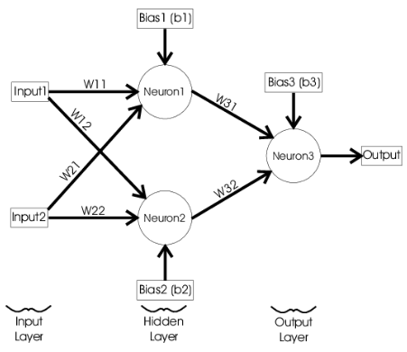


4. Для красоты обернуть в класс Model с методами forward и backward, реализующими правильное взаимодействие нейронов на прямом и обратном проходах.
5. Реализовать тренировочный цикл следующего вида:

```  python
цикл (обучающие данные):
	y = model.forward(x)
	err = loss(y, label)
	model.backward(x, err)
```


```python
# В итоге обучения должны предсказываться значения аналогичные описанным в статье.  
{(0,0):0, (0,1):1, (1, 0):1, (1,1):0}
```
