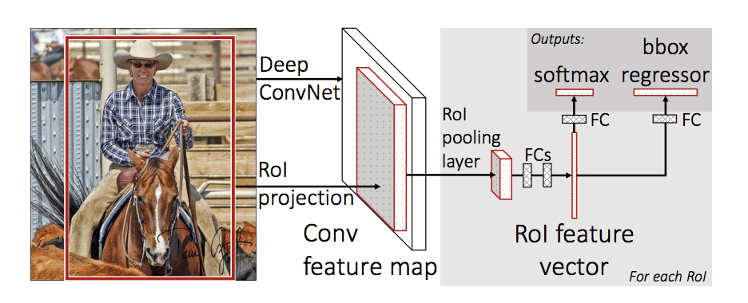

## Сверточная нейронная сеть


## Датасет ImageNet
ImageNet — набор данных, состоящий из более чем 15 миллионов размеченных высококачественных изображений, разделенных на 22000 категорий. Изображения были взяты из интернета и размечены вручную людьми-разметчиками 


На август 2017 года в ImageNet 14 197 122 изображения, разбитых на 21 841 категорию.


# Архитектуры нейронных сетей

## AlexNet
Архитектура AlexNet состоит из пяти свёрточных слоёв, между которыми располагаются pooling-слои и слои нормализации, а завершают нейросеть три полносвязных слоя.  
На схеме архитектуры все выходные изображения делятся на два одинаковых участка — это связано с тем, что нейросеть обучалась на старых GPU GTX580, у которых было всего 3 ГБ видеопамяти. Для обработки использовались две видеокарты, чтобы параллельно выполнять операции над двумя частями изображения.


# VGG-16
VGG16 — одна из самых знаменитых моделей, отправленных на соревнование ILSVRC-2014. Она является улучшенной версией AlexNet, в которой заменены большие фильтры (размера 11 и 5 в первом и втором сверточном слое, соответственно) на несколько фильтров размера 3х3, следующих один за другим. Сеть VGG16 обучалась на протяжении нескольких недель при использовании видеокарт NVIDIA TITAN BLACK.


## VGG-19
Основная идея VGG-архитектур — использование большего числа слоёв с фильтрами меньшего размера. Существуют версии VGG-16 и VGG-19 с 16 и 19 слоями соответственно.  
С маленькими фильтрами получается не так много параметров, но при этом мы сможем гораздо эффективнее обрабатывать их.


## ResNet
Основой сети ResNet является Residual-блок (остаточный блок) с shortcut-соединением, через которое данные проходят без изменений. Res-блок представляет собой несколько сверточных слоев с активациями, которые преобразуют входной сигнал x в F(x). Shortcut-соединение — это тождественное преобразование x -> x.

Создатели ResNet решили не складывать слои друг на друга для изучения отображения нужной функции напрямую, а использовать остаточные блоки, 
которые пытаются «подогнать» это отображение. Так ResNet стала первой остаточной нейронной сетью. 
Иначе говоря, она «перепрыгивает» через некоторые слои. Они больше не содержат признаков и используются для нахождения остаточной функции H(x) = F(x) + x вместо того, чтобы искать H(x) напрямую.


В результате экспериментов с ResNet выяснилось, что очень глубокие сети действительно можно обучить без ухудшения точности. Нейросеть достигла наименьшей ошибки в задачах классификации, которая превзошла даже человеческий результат.


## MobileNet V2

- Особенностью данной архитектуры является отсутствие max pooling-слоёв. Вместо них для снижения пространственной размерности используется свёртка с параметром stride равным 2. Также изменение свёртки уменьшает количество операций сети


# Сегментация изображений


## Fully Convolutional Network


# SegNet


Upsampling:

https://pytorch.org/docs/stable/generated/torch.nn.Upsample.html

# UNet
U-Net — это свёрточная нейронная сеть, которая была создана в 2015 году для сегментации биомедицинских изображений в отделении Computer Science Фрайбургского университета. Архитектура сети представляет собой полносвязную свёрточную сеть, модифицированную так, чтобы она могла работать с меньшим количеством примеров (обучающих образов) и делала более точную сегментацию.


## Метрика
Intersection over union (IoU)


## Функция потерь

* Cross entropy
* Weighted cross entropy
* DICE
$$ DC = 1 - {2\sum y_i p_i \over \sum y_i + \sum p_i} $$

# Детекция


## Non-maximum Suppression (NMS)
Алгоритм:  
1) Выбрать область с наибольшией уверенностью и запомнить его  
2) Найти IoU с оставшимися областями  
3) Удалить области с IoU больше заданного порога  
4) Повторять пп. 1-3, пока все области не отфильтруются  


# Single Shot Detectors

## Yolo
Изображение делится на части и предсказывается отдельно для каждой части


Каждая часть предсказывает координаты, уверенность и вероятность каждого из 20 классов


## SSD


# Two Shot Detectors

https://habr.com/ru/company/jetinfosystems/blog/498294/

## R-CNN


## R-CNN


https://habr.com/ru/company/jetinfosystems/blog/498652/

## Fast R-CNN


## Faster R-CNN


## Сравнение скоростей


```python
# define model
model = torchvision.models.resnet18(pretrained=True)
avgpool_emb = None

def get_embedding(module, inputs, output):
    global avgpool_emb
    avgpool_emb = output

model.avgpool.register_forward_hook(get_embedding)
model.eval()
```

## Лабораторная работа 15.
Задание:
Сделать визуализацию работы Resnet50 (как на видео https://www.youtube.com/watch?v=fZvOy0VXWAI&t=85s)
1. Установить torch, torchvision, скачать Resnet (pretrained=True)
2. Написать функцию get_features_map() (установить hook), которая "возвращает" результаты работы слоя layer4 (находится перед слоем avgpool)
3. Достать из модели матрицу весов "W" последнего (полносвязного) слоя (fc).
4. Сложить карты признаков (2048 штук для ResNet50), с коэффициентами w_i, как показано в "статье" - https://alexisbcook.github.io/posts/global-average-pooling-layers-for-object-localization/


