# Введение Машинное обучение. Часть 1

## Что такое машинное обучение
Машинное обучение (Machine Learning) — обширный подраздел искусственного интеллекта, 
изучающий методы построения алгоритмов, способных обучаться.   

Различают два типа обучения: 
* Обучение по прецедентам, или индуктивное обучение (обучение без учителя), 
основано на выявлении общих закономерностей по частным эмпирическим данным.   
* Дедуктивное обучение (обучение с учителем) предполагает формализацию знаний экспертов и их перенос в компьютер в виде базы знаний.  
Дедуктивное обучение принято относить к области экспертных систем, поэтому термины машинное обучение и обучение по прецедентам можно считать синонимами.  

### Решаемые задачи:
* Предсказание спроса
* Распознавание изображений
* Распознавание людей
* Определение возраста
* Детектирование объектов
* Определение позы
* Чат-боты
* Переводчики


### Основные задачи машинного обучения

__Задача классификации__ — задача, в которой имеется множество объектов (ситуаций), разделённых некоторым образом на классы.

Примеры задач классификации:
* Задачи медицинской диагностики
* Предсказание месторождений полезных ископаемых
* Предсказание оттока клиентов
* Оптическое распознавание символов
* Обнаружение спама
* Предсказание возраста


__Задача регрессии__ - задача, которая позволяет определить по известным характеристикам объекта значение некоторого его параметра. В отличие от задачи классификации значением параметра является не конечное множество классов, а множество действительных чисел.

Примеры задач регрессии:
* Восстановление зависимости переменных
* Предсказание добычи
* Предсказание возраста

__Задача кластеризации__ - задача, которая заключается в поиске независимых групп (кластеров) и их характеристик во всем множестве анализируемых данных. Решение этой задачи помогает лучше понять данные. Кроме того, группировка однородных объектов позволяет сократить их число, а следовательно, и облегчить анализ.

Примеры задач кластеризации:
* Разбиение клиентов на целевые группы
* Выделение групп людей на основе графа связей в социальных сетях
* Повышение релевантности ответов на поисковые запросы путем группировки веб-сайтов по смысловым значениям поискового запроса
* Кластеризация используется в сегментации изображений для определения границ и распознавания объектов

## Библиотека Scikit-learn

Для работы с Машинным обучением в Python используется библиотека Scikit-learn.  

__Библиотека Scikit-learn__ — самый распространенный выбор для решения задач классического машинного обучения. Она предоставляет широкий выбор алгоритмов обучения с учителем и без учителя. Одно из основных преимуществ библиотеки состоит в том, что она работает на основе нескольких распространенных математических библиотек, и легко интегрирует их друг с другом. Еще одним преимуществом является широкое сообщество и подробная документация. 


Библиотека реализует следующие основные методы:

* __Линейные__: модели, задача которых построить разделяющую (для классификации) или аппроксимирующую (для регрессии) гиперплоскость.
* __Деревья решений__: обучение моделей, базирующихся на множестве условий, оптимально выбранных для решения задачи.
* __Ансамблевые методы__: методы, основанные на деревьях решений, которые комбинируют мощь множества деревьев, и таким образом повышают их качество работы, а также позволяют производить отбор признаков (бустинг, бэггинг, случайный лес, мажоритарное голосование).
* __Нейронные сети__: комплексный нелинейный метод для задач регрессии и классификации.
* __SVM__: нелинейный метод, который обучается определять границы принятия решений.
* __Наивный Байес__: прямое вероятностное моделирование для задач классификации.
* __PCA__: линейный метод понижения размерности и отбора признаков
* __t-SNE__: нелинейный метод понижения размерности.
* __K-средних__: самый распространенный метод для кластеризации, требущий на вход число кластеров, по которым должны быть распределены данные.

#### Пример решения задачи

Большинство моделей для машинного обучения представляют собой математические модели с обучаемыми коэффициентами.  
К примеру, Машина Опорных Векторов задаётся гиперплоскостями, которые разделяют заданные характеристики на 2 группы. Параметры этих плоскостей являются обучаемыми параметрами


Множество точек ${(x_1, c_1), (x_2, c_2), ..., (x_n, c_n)}$, где $c_i$ - класс (1 или -1), а $x_i$ - вектор координат точек.   
**Задача**: задать гиперплоскость $wx + b = 0$, которая бы наилучшим образом разделяла эти классы  
Вектор $w$   — перпендикуляр к разделяющей гиперплоскости.  
Параметр $b \over {||w||}$ равен по модулю расстоянию от гиперплоскости до начала координат.  
  
Для оптимального разделения строятся 2 параллельные плоскости $wx + b = 1$ и $wx + b = -1$. Расстояние между ними равно $2 \over {||w||}$


Задача сводится к минимизации w и выполнении для всех i:
$$
\begin{cases}
w  x_i - b \geq 1 &{c_i = 1} \\
w  x_i - b \leq -1 &{c_i = -1} \
\end{cases}
$$

## Аналитика данных
### Показ данных numpy+matplotlib
```python
import matplotlib.pyplot as plt
import numpy as np

%matplotlib inline

# Генерируем данные
np.random.seed(18182)
xs = np.arange(10)
ys1 = np.random.randint(10, size=10)
ys2 = np.random.randint(10, size=10)

# Рисовании линии
plt.plot(xs, ys1, label='Линия')
# Рисовании точек
plt.scatter(xs, ys2,color='red', label='Точки', marker='<')
# Подписи осей
plt.xlabel('Ось X')
plt.ylabel('Ось Y')

plt.title('Какие-то точки')  # Заголовок
plt.grid()  # Добавление сетки координат
plt.legend()  # Добавление легенды
plt.show()
```
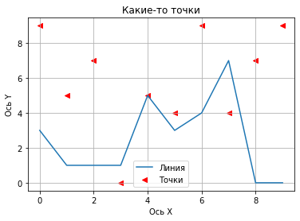
Рисование гистограмм
```python
# Столбцы
plt.bar(xs, ys1)
plt.show()

plt.bar(xs, ys1)
plt.bar(xs, ys2, bottom=ys1)
plt.show()
```
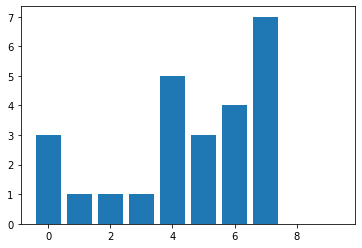
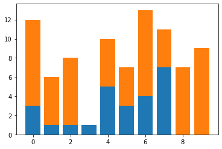
Ещё гистограммы
```python
plt.bar(xs, ys1, width=0.3)
plt.bar(xs+0.2, ys2, width=0.3)
plt.grid()
plt.show()
```
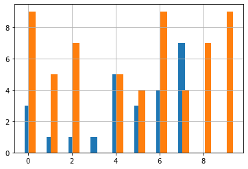

Изменение числа видимых столбцов
```python
# Гистограмма
np.random.seed(18182)
vals = np.random.rand(1000)
plt.hist(vals, bins=100) # было 100 
plt.show()
plt.hist(vals, bins=10)  # стало 10
plt.show()
```
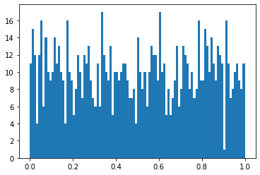
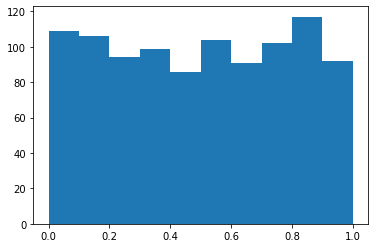

Нормализованные данные
```python
np.random.seed(18182)
vals = np.random.normal(size=10000)
mn, std = vals.mean(), vals.std()
print(f'Mean: {mn:.2}, Std: {std:.2}')
plt.hist(vals, bins=100)
plt.axvline(mn - 3*std, color='red')
plt.axvline(mn + 3*std, color='red')
plt.show()
```
    Mean: 0.0033, Std: 1.0
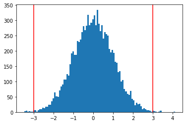

### Показ данных в pandas
```python
import pandas as pd
# dataframe
df = pd.read_csv('data/wells_info.csv')
df.head()
```
<div>
<style scoped>
    .dataframe tbody tr th:only-of-type {
        vertical-align: middle;
    }

    .dataframe tbody tr th {
        vertical-align: top;
    }

    .dataframe thead th {
        text-align: right;
    }
</style>
<table border="1" class="dataframe">
  <thead>
    <tr style="text-align: right;">
      <th></th>
      <th>API</th>
      <th>PermitDate</th>
      <th>SpudDate</th>
      <th>CompletionDate</th>
      <th>FirstProductionDate</th>
      <th>operatorNameIHS</th>
      <th>formation</th>
      <th>BasinName</th>
      <th>StateName</th>
      <th>CountyName</th>
      <th>LatWGS84</th>
      <th>LonWGS84</th>
      <th>BottomHoleLatitude</th>
      <th>BottomHoleLongitude</th>
      <th>LATERAL_LENGTH_BLEND</th>
      <th>PROP_PER_FOOT</th>
      <th>WATER_PER_FOOT</th>
    </tr>
  </thead>
  <tbody>
    <tr>
      <th>0</th>
      <td>5005072170100</td>
      <td>2014-05-06</td>
      <td>2014-05-06</td>
      <td>2014-12-02</td>
      <td>2014-11-01 00:00:00.000</td>
      <td>BURLINGTON RESOURCES O&amp;G CO LP</td>
      <td>NIOBRARA</td>
      <td>DENVER BASIN</td>
      <td>COLORADO</td>
      <td>ARAPAHOE</td>
      <td>39.684606</td>
      <td>-104.642128</td>
      <td>39.68445</td>
      <td>-104.60557</td>
      <td>9005.0</td>
      <td>994.6866</td>
      <td>591.8004</td>
    </tr>
    <tr>
      <th>1</th>
      <td>5123377130000</td>
      <td>2013-07-21</td>
      <td>2013-10-06</td>
      <td>2014-02-26</td>
      <td>2014-02-01 00:00:00.000</td>
      <td>SRC ENERGY INCORPORATED</td>
      <td>NIOBRARA</td>
      <td>DENVER BASIN</td>
      <td>COLORADO</td>
      <td>WELD</td>
      <td>40.509320</td>
      <td>-104.780980</td>
      <td>40.49692</td>
      <td>-104.77859</td>
      <td>4195.0</td>
      <td>991.5857</td>
      <td>628.6321</td>
    </tr>
    <tr>
      <th>2</th>
      <td>5123379280000</td>
      <td>2013-09-08</td>
      <td>2013-09-25</td>
      <td>2014-09-07</td>
      <td>2013-11-01 00:00:00.000</td>
      <td>BONANZA CREEK ENERGY OPERATING CO LLC</td>
      <td>NIOBRARA</td>
      <td>DENVER BASIN</td>
      <td>COLORADO</td>
      <td>WELD</td>
      <td>40.335390</td>
      <td>-104.363000</td>
      <td>40.34780</td>
      <td>-104.36863</td>
      <td>4273.0</td>
      <td>1000.2760</td>
      <td>564.4841</td>
    </tr>
    <tr>
      <th>3</th>
      <td>5123379400000</td>
      <td>2013-09-11</td>
      <td>2014-12-05</td>
      <td>2015-03-31</td>
      <td>2015-03-01 00:00:00.000</td>
      <td>NOBLE ENERGY INCORPORATED</td>
      <td>NIOBRARA</td>
      <td>DENVER BASIN</td>
      <td>COLORADO</td>
      <td>WELD</td>
      <td>40.152220</td>
      <td>-104.530780</td>
      <td>40.17445</td>
      <td>-104.52932</td>
      <td>7078.0</td>
      <td>973.4437</td>
      <td>824.0020</td>
    </tr>
    <tr>
      <th>4</th>
      <td>5123385820100</td>
      <td>2014-01-07</td>
      <td>2014-01-13</td>
      <td>2014-04-23</td>
      <td>2014-04-01 00:00:00.000</td>
      <td>GREAT WESTERN OPERATING COMPANY LLC</td>
      <td>NIOBRARA</td>
      <td>DENVER BASIN</td>
      <td>COLORADO</td>
      <td>WELD</td>
      <td>40.508303</td>
      <td>-104.868180</td>
      <td>40.49558</td>
      <td>-104.86757</td>
      <td>3211.0</td>
      <td>783.5919</td>
      <td>603.1414</td>
    </tr>
  </tbody>
</table>
</div>

```python
df.plot('BottomHoleLatitude', 'BottomHoleLongitude', kind='scatter')
plt.show()
```
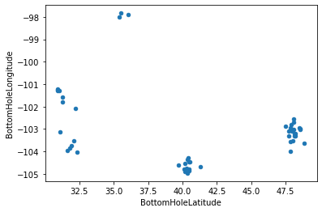

```python
df.drop('API', axis=1).boxplot()
plt.xticks(rotation=-25)
plt.show()
```
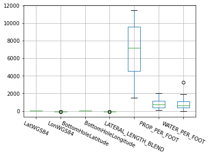
    
```python
# pandas позволяет работать с датами и временем
df['CompletionDate'] = pd.to_datetime(df['CompletionDate'])
df['CompletionDate'].hist()
plt.show()
```
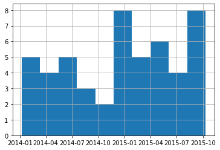

```python
df['Month'] = df['CompletionDate'].dt.month
df.groupby('Month').mean()[['LonWGS84', 'BottomHoleLongitude']].plot(alpha=0.5, grid=True)
plt.show()
```
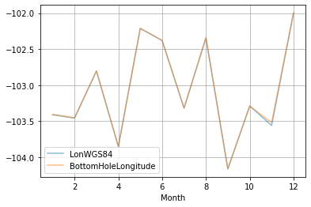

#### Отображение с группировкой

```python
# Гистограмма по группам
df.hist('LatWGS84', by='formation', figsize=(8, 8))
plt.subplots_adjust(hspace=0.9)
plt.show()
```
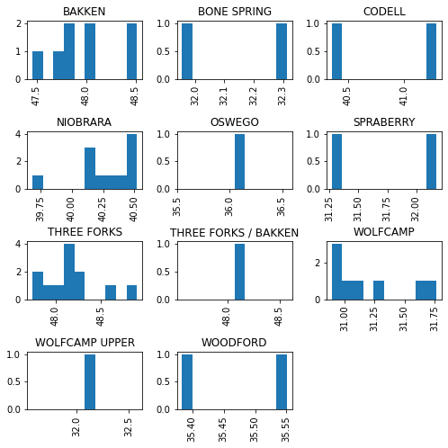

```python
# Boxplot по группам
df.boxplot('LatWGS84', by='formation', figsize=(8, 6))
plt.subplots_adjust(hspace=0.9)
plt.xticks(rotation=-25, ha='left')
plt.show()
```
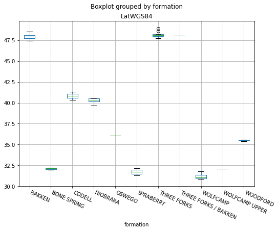

### Примеры применения Seaborn

**Seaborn** — это библиотека для создания статистических графиков на Python. Она построена на основе *matplotlib* и тесно интегрируется со структурами данных *pandas*.

```python
import seaborn as sns

cols = ['LonWGS84', 'LatWGS84', 'BottomHoleLongitude', 'BottomHoleLatitude']
sns.pairplot(df[cols])
plt.show()
```
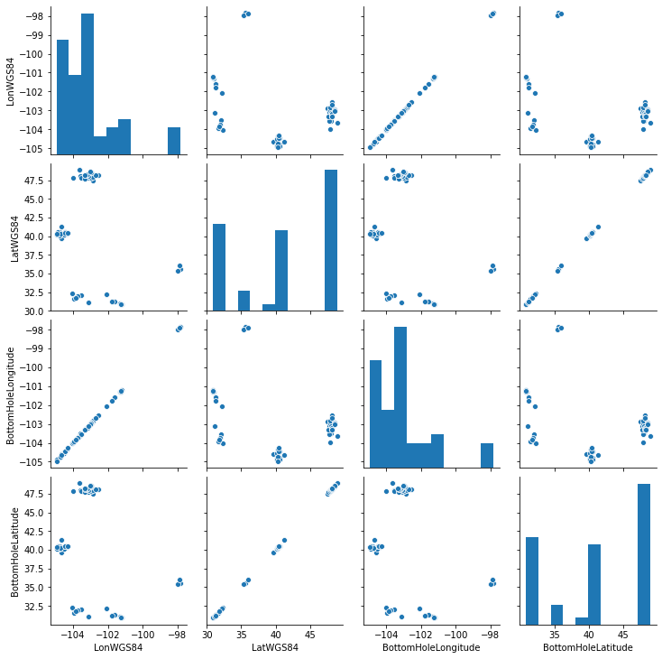

```python
sns.distplot(df['BottomHoleLongitude'])
plt.show()
```
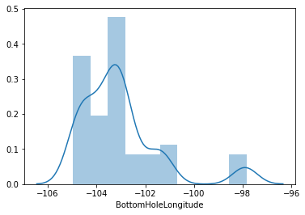

```python
sns.jointplot(df['LonWGS84'], df['LatWGS84'])
plt.show()
```
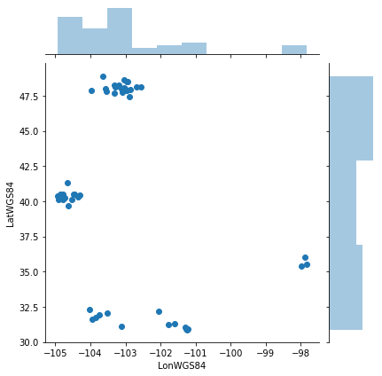

```python
# Матрица корреляции
corr_matrix = df.corr()
sns.heatmap(corr_matrix)
```
    <matplotlib.axes._subplots.AxesSubplot at 0x7f25b0619550>
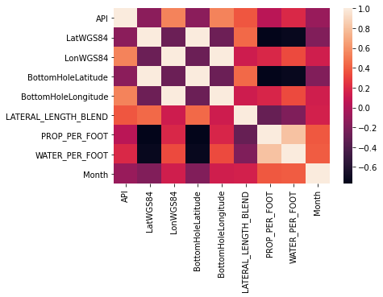
    

## Работа с признаками

Работа с признаками делится на 3 этапа:
* Извлечение признаков – превращение данных, специфических для предметной области, в понятные для модели векторы
* Преобразования признаков – трансформация данных для повышения точности алгоритма
* Выбор признаков – отсечение ненужных признаков

### Извлечение признаков (Feature Extraction)
#### Тексты
```python
# N-граммы (комбинации из N последовательных терминов)
from sklearn.feature_extraction.text import CountVectorizer

print("Модель для N-грамм от 1 до 1 слова")
vect = CountVectorizer(ngram_range=(1, 1)) 
res = vect.fit_transform(['он не делает работу', 'не он делает работу']).toarray()
print(res)
print(vect.vocabulary_)

print()
print("Модель для N-грамм от 1 до 2 слов")
vect = CountVectorizer(ngram_range=(1, 2)) 
res = vect.fit_transform(['он не делает работу', 'не он делает работу']).toarray()
print(res)
print(vect.vocabulary_)
```

    Модель для N-грамм от 1 до 1 слова
    [[1 1 1 1]
     [1 1 1 1]]
    {'не': 1, 'работу': 3, 'он': 2, 'делает': 0}
    
    Модель для N-грамм от 1 до 2 слов
    [[1 1 1 1 0 1 0 1 1]
     [1 1 1 0 1 1 1 0 1]]
    {'не': 2, 'он': 5, 'он не': 7, 'не он': 4, 'делает работу': 1, 'делает': 0, 'не делает': 3, 'работу': 8, 'он делает': 6}

#### Term Frequency - Inverse Document Frequency
__TF-IDF__ — статистическая мера, используемая для оценки важности слова в контексте документа, являющегося частью коллекции документов или корпуса. Вес некоторого слова пропорционален частоте употребления этого слова в документе и обратно пропорционален частоте употребления слова во всех документах коллекции.


Картинка *Word2Vec*


#### Изображения
```python
import matplotlib.pyplot as plt
import numpy as np
%matplotlib inline

image = plt.imread('data/eye.jpg')
print(image.shape)
print(image[:2, :3])
plt.imshow(image)
plt.show()
```
    (206, 245, 3)
    [[[255 255 255]
      [255 255 255]
      [255 255 255]]
    
     [[255 255 255]
      [255 255 255]
      [255 255 255]]]
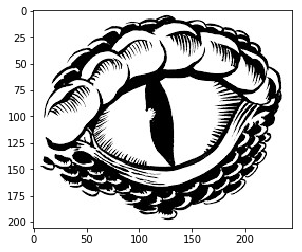

#### pandas получение времени и даты
```python
import numpy as np
import pandas as pd

# Устанавливаем точность для отображения вещественных чисел numpy массивов
np.set_printoptions(precision=3)

df = pd.read_csv('data/wells_info.csv')
df['CompletionDate'] = pd.to_datetime(df['CompletionDate'])
df.head()
```
<div>
<style scoped>
    .dataframe tbody tr th:only-of-type {
        vertical-align: middle;
    }

    .dataframe tbody tr th {
        vertical-align: top;
    }

    .dataframe thead th {
        text-align: right;
    }
</style>
<table border="1" class="dataframe">
  <thead>
    <tr style="text-align: right;">
      <th></th>
      <th>API</th>
      <th>PermitDate</th>
      <th>SpudDate</th>
      <th>CompletionDate</th>
      <th>FirstProductionDate</th>
      <th>operatorNameIHS</th>
      <th>formation</th>
      <th>BasinName</th>
      <th>StateName</th>
      <th>CountyName</th>
      <th>LatWGS84</th>
      <th>LonWGS84</th>
      <th>BottomHoleLatitude</th>
      <th>BottomHoleLongitude</th>
      <th>LATERAL_LENGTH_BLEND</th>
      <th>PROP_PER_FOOT</th>
      <th>WATER_PER_FOOT</th>
    </tr>
  </thead>
  <tbody>
    <tr>
      <th>0</th>
      <td>5005072170100</td>
      <td>2014-05-06</td>
      <td>2014-05-06</td>
      <td>2014-12-02</td>
      <td>2014-11-01 00:00:00.000</td>
      <td>BURLINGTON RESOURCES O&amp;G CO LP</td>
      <td>NIOBRARA</td>
      <td>DENVER BASIN</td>
      <td>COLORADO</td>
      <td>ARAPAHOE</td>
      <td>39.684606</td>
      <td>-104.642128</td>
      <td>39.68445</td>
      <td>-104.60557</td>
      <td>9005.0</td>
      <td>994.6866</td>
      <td>591.8004</td>
    </tr>
    <tr>
      <th>1</th>
      <td>5123377130000</td>
      <td>2013-07-21</td>
      <td>2013-10-06</td>
      <td>2014-02-26</td>
      <td>2014-02-01 00:00:00.000</td>
      <td>SRC ENERGY INCORPORATED</td>
      <td>NIOBRARA</td>
      <td>DENVER BASIN</td>
      <td>COLORADO</td>
      <td>WELD</td>
      <td>40.509320</td>
      <td>-104.780980</td>
      <td>40.49692</td>
      <td>-104.77859</td>
      <td>4195.0</td>
      <td>991.5857</td>
      <td>628.6321</td>
    </tr>
    <tr>
      <th>2</th>
      <td>5123379280000</td>
      <td>2013-09-08</td>
      <td>2013-09-25</td>
      <td>2014-09-07</td>
      <td>2013-11-01 00:00:00.000</td>
      <td>BONANZA CREEK ENERGY OPERATING CO LLC</td>
      <td>NIOBRARA</td>
      <td>DENVER BASIN</td>
      <td>COLORADO</td>
      <td>WELD</td>
      <td>40.335390</td>
      <td>-104.363000</td>
      <td>40.34780</td>
      <td>-104.36863</td>
      <td>4273.0</td>
      <td>1000.2760</td>
      <td>564.4841</td>
    </tr>
    <tr>
      <th>3</th>
      <td>5123379400000</td>
      <td>2013-09-11</td>
      <td>2014-12-05</td>
      <td>2015-03-31</td>
      <td>2015-03-01 00:00:00.000</td>
      <td>NOBLE ENERGY INCORPORATED</td>
      <td>NIOBRARA</td>
      <td>DENVER BASIN</td>
      <td>COLORADO</td>
      <td>WELD</td>
      <td>40.152220</td>
      <td>-104.530780</td>
      <td>40.17445</td>
      <td>-104.52932</td>
      <td>7078.0</td>
      <td>973.4437</td>
      <td>824.0020</td>
    </tr>
    <tr>
      <th>4</th>
      <td>5123385820100</td>
      <td>2014-01-07</td>
      <td>2014-01-13</td>
      <td>2014-04-23</td>
      <td>2014-04-01 00:00:00.000</td>
      <td>GREAT WESTERN OPERATING COMPANY LLC</td>
      <td>NIOBRARA</td>
      <td>DENVER BASIN</td>
      <td>COLORADO</td>
      <td>WELD</td>
      <td>40.508303</td>
      <td>-104.868180</td>
      <td>40.49558</td>
      <td>-104.86757</td>
      <td>3211.0</td>
      <td>783.5919</td>
      <td>603.1414</td>
    </tr>
  </tbody>
</table>
</div>

```python
# Получение дня недели
df['CompletionDate'].dt.dayofweek[:4]
```
    0    1
    1    2
    2    6
    3    1
    Name: CompletionDate, dtype: int64

```python
# Проекция на окружность с последующим использованием двух координат
def make_harmonic_features(value, period=24):
    value *= 2 * np.pi / period
    return np.cos(value), np.sin(value)

hours = np.random.randint(0, 24, size=(10)).astype(float)
print(hours)
cos_, sin_ = make_harmonic_features(hours)
print(cos_)
print(sin_)
```

    [ 7.  3. 11. 16. 11. 19.  1. 14.  8. 14.]
    [-0.259  0.707 -0.966 -0.5   -0.966  0.259  0.966 -0.866 -0.5   -0.866]
    [ 0.966  0.707  0.259 -0.866  0.259 -0.966  0.259 -0.5    0.866 -0.5  ]


#### pandas Категории
```python
df['formation'][8:15]
```

    8           NIOBRARA
    9             CODELL
    10          NIOBRARA
    11          NIOBRARA
    12       BONE SPRING
    13    WOLFCAMP UPPER
    14       THREE FORKS
    Name: formation, dtype: object

```python
pd.get_dummies(df['formation'])[8:15]
```
<div>
<style scoped>
    .dataframe tbody tr th:only-of-type {
        vertical-align: middle;
    }

    .dataframe tbody tr th {
        vertical-align: top;
    }

    .dataframe thead th {
        text-align: right;
    }
</style>
<table border="1" class="dataframe">
  <thead>
    <tr style="text-align: right;">
      <th></th>
      <th>BAKKEN</th>
      <th>BONE SPRING</th>
      <th>CODELL</th>
      <th>NIOBRARA</th>
      <th>OSWEGO</th>
      <th>SPRABERRY</th>
      <th>THREE FORKS</th>
      <th>THREE FORKS / BAKKEN</th>
      <th>WOLFCAMP</th>
      <th>WOLFCAMP UPPER</th>
      <th>WOODFORD</th>
    </tr>
  </thead>
  <tbody>
    <tr>
      <th>8</th>
      <td>0</td>
      <td>0</td>
      <td>0</td>
      <td>1</td>
      <td>0</td>
      <td>0</td>
      <td>0</td>
      <td>0</td>
      <td>0</td>
      <td>0</td>
      <td>0</td>
    </tr>
    <tr>
      <th>9</th>
      <td>0</td>
      <td>0</td>
      <td>1</td>
      <td>0</td>
      <td>0</td>
      <td>0</td>
      <td>0</td>
      <td>0</td>
      <td>0</td>
      <td>0</td>
      <td>0</td>
    </tr>
    <tr>
      <th>10</th>
      <td>0</td>
      <td>0</td>
      <td>0</td>
      <td>1</td>
      <td>0</td>
      <td>0</td>
      <td>0</td>
      <td>0</td>
      <td>0</td>
      <td>0</td>
      <td>0</td>
    </tr>
    <tr>
      <th>11</th>
      <td>0</td>
      <td>0</td>
      <td>0</td>
      <td>1</td>
      <td>0</td>
      <td>0</td>
      <td>0</td>
      <td>0</td>
      <td>0</td>
      <td>0</td>
      <td>0</td>
    </tr>
    <tr>
      <th>12</th>
      <td>0</td>
      <td>1</td>
      <td>0</td>
      <td>0</td>
      <td>0</td>
      <td>0</td>
      <td>0</td>
      <td>0</td>
      <td>0</td>
      <td>0</td>
      <td>0</td>
    </tr>
    <tr>
      <th>13</th>
      <td>0</td>
      <td>0</td>
      <td>0</td>
      <td>0</td>
      <td>0</td>
      <td>0</td>
      <td>0</td>
      <td>0</td>
      <td>0</td>
      <td>1</td>
      <td>0</td>
    </tr>
    <tr>
      <th>14</th>
      <td>0</td>
      <td>0</td>
      <td>0</td>
      <td>0</td>
      <td>0</td>
      <td>0</td>
      <td>1</td>
      <td>0</td>
      <td>0</td>
      <td>0</td>
      <td>0</td>
    </tr>
  </tbody>
</table>
</div>


## Преобразования признаков (Feature transformations)
### Нормализация и изменение распределения
```python
df_num = df[['LatWGS84', 'LonWGS84', 'BottomHoleLatitude',
       'BottomHoleLongitude', 'LATERAL_LENGTH_BLEND', 'PROP_PER_FOOT',
       'WATER_PER_FOOT']]
df_num.head()
```
<div>
<style scoped>
    .dataframe tbody tr th:only-of-type {
        vertical-align: middle;
    }

    .dataframe tbody tr th {
        vertical-align: top;
    }

    .dataframe thead th {
        text-align: right;
    }
</style>
<table border="1" class="dataframe">
  <thead>
    <tr style="text-align: right;">
      <th></th>
      <th>LatWGS84</th>
      <th>LonWGS84</th>
      <th>BottomHoleLatitude</th>
      <th>BottomHoleLongitude</th>
      <th>LATERAL_LENGTH_BLEND</th>
      <th>PROP_PER_FOOT</th>
      <th>WATER_PER_FOOT</th>
    </tr>
  </thead>
  <tbody>
    <tr>
      <th>0</th>
      <td>39.684606</td>
      <td>-104.642128</td>
      <td>39.68445</td>
      <td>-104.60557</td>
      <td>9005.0</td>
      <td>994.6866</td>
      <td>591.8004</td>
    </tr>
    <tr>
      <th>1</th>
      <td>40.509320</td>
      <td>-104.780980</td>
      <td>40.49692</td>
      <td>-104.77859</td>
      <td>4195.0</td>
      <td>991.5857</td>
      <td>628.6321</td>
    </tr>
    <tr>
      <th>2</th>
      <td>40.335390</td>
      <td>-104.363000</td>
      <td>40.34780</td>
      <td>-104.36863</td>
      <td>4273.0</td>
      <td>1000.2760</td>
      <td>564.4841</td>
    </tr>
    <tr>
      <th>3</th>
      <td>40.152220</td>
      <td>-104.530780</td>
      <td>40.17445</td>
      <td>-104.52932</td>
      <td>7078.0</td>
      <td>973.4437</td>
      <td>824.0020</td>
    </tr>
    <tr>
      <th>4</th>
      <td>40.508303</td>
      <td>-104.868180</td>
      <td>40.49558</td>
      <td>-104.86757</td>
      <td>3211.0</td>
      <td>783.5919</td>
      <td>603.1414</td>
    </tr>
  </tbody>
</table>
</div>

Масштабирование
```python
from sklearn.preprocessing import MinMaxScaler, StandardScaler

scaler = StandardScaler()  # (x - x.mean()) / x.std()
df_scaled = scaler.fit_transform(df_num)
print(df_scaled[:4])

scaler = MinMaxScaler()  # (x - x.min()) / (x.max() - x.min())
df_scaled = scaler.fit_transform(df_num)
print(df_scaled[:4])
print()
```

    [[-0.196 -0.958 -0.195 -0.938  0.734  0.423 -0.289]
     [-0.075 -1.042 -0.076 -1.043 -1.094  0.416 -0.228]
     [-0.1   -0.789 -0.098 -0.795 -1.064  0.434 -0.334]
     [-0.127 -0.891 -0.123 -0.892  0.002  0.378  0.094]]
    [[0.488 0.043 0.489 0.05  0.751 0.456 0.18 ]
     [0.534 0.023 0.534 0.026 0.269 0.454 0.191]
     [0.525 0.082 0.526 0.083 0.277 0.459 0.172]
     [0.514 0.058 0.516 0.061 0.558 0.445 0.251]]
    


Изменение распределения
```python
from scipy.stats import lognorm

# Содаем случайные данные с логнормальным распределением
data = lognorm(s=1).rvs(1000)
plt.hist(data, bins=100)
plt.show()

# С помощью логарифмирования приводим к нормальному распределению
plt.hist(np.log(data), bins=100)
plt.show()
```
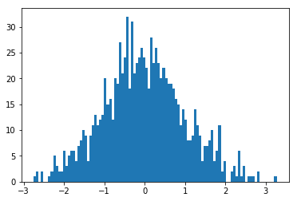

### Генерация новых признаков
```python
# Проверка, является ли день завершения выходным
is_weekend = df['CompletionDate'].dt.dayofweek.isin([5, 6]).astype(int)

# Оставляем лишь те координаты, когда день завершения является выходным
df_coord = (df[['LatWGS84', 'LonWGS84']].T * is_weekend).T
df_coord.head()
```
<div>
<style scoped>
    .dataframe tbody tr th:only-of-type {
        vertical-align: middle;
    }

    .dataframe tbody tr th {
        vertical-align: top;
    }

    .dataframe thead th {
        text-align: right;
    }
</style>
<table border="1" class="dataframe">
  <thead>
    <tr style="text-align: right;">
      <th></th>
      <th>LatWGS84</th>
      <th>LonWGS84</th>
    </tr>
  </thead>
  <tbody>
    <tr>
      <th>0</th>
      <td>0.00000</td>
      <td>-0.000</td>
    </tr>
    <tr>
      <th>1</th>
      <td>0.00000</td>
      <td>-0.000</td>
    </tr>
    <tr>
      <th>2</th>
      <td>40.33539</td>
      <td>-104.363</td>
    </tr>
    <tr>
      <th>3</th>
      <td>0.00000</td>
      <td>-0.000</td>
    </tr>
    <tr>
      <th>4</th>
      <td>0.00000</td>
      <td>-0.000</td>
    </tr>
  </tbody>
</table>
</div>


### Pandas заполнение пропусков
```python
df_na = pd.read_csv('data/wells_info_na.csv')
df_na
```
<div>
<style scoped>
    .dataframe tbody tr th:only-of-type {
        vertical-align: middle;
    }

    .dataframe tbody tr th {
        vertical-align: top;
    }

    .dataframe thead th {
        text-align: right;
    }
</style>
<table border="1" class="dataframe">
  <thead>
    <tr style="text-align: right;">
      <th></th>
      <th>API</th>
      <th>CompletionDate</th>
      <th>FirstProductionDate</th>
      <th>formation</th>
      <th>BasinName</th>
      <th>StateName</th>
      <th>CountyName</th>
      <th>LatWGS84</th>
      <th>LonWGS84</th>
      <th>PROP_PER_FOOT</th>
    </tr>
  </thead>
  <tbody>
    <tr>
      <th>0</th>
      <td>5123402600000</td>
      <td>2015-09-13</td>
      <td>2015-09-01 00:00:00.000</td>
      <td>CODELL</td>
      <td>DENVER BASIN</td>
      <td>COLORADO</td>
      <td>WELD</td>
      <td>40.353967</td>
      <td>-104.944679</td>
      <td>926.5010</td>
    </tr>
    <tr>
      <th>1</th>
      <td>5123409020000</td>
      <td>2015-09-07</td>
      <td>2015-09-01 00:00:00.000</td>
      <td>NIOBRARA</td>
      <td>NaN</td>
      <td>COLORADO</td>
      <td>WELD</td>
      <td>40.482361</td>
      <td>-104.468261</td>
      <td>697.0967</td>
    </tr>
    <tr>
      <th>2</th>
      <td>5123410480000</td>
      <td>NaN</td>
      <td>2015-04-01 00:00:00.000</td>
      <td>NIOBRARA</td>
      <td>DENVER BASIN</td>
      <td>NaN</td>
      <td>WELD</td>
      <td>NaN</td>
      <td>NaN</td>
      <td>896.9146</td>
    </tr>
    <tr>
      <th>3</th>
      <td>30015414470000</td>
      <td>2014-01-07</td>
      <td>2013-12-01 00:00:00.000</td>
      <td>BONE SPRING</td>
      <td>PERMIAN BASIN</td>
      <td>NEW MEXICO</td>
      <td>EDDY</td>
      <td>NaN</td>
      <td>NaN</td>
      <td>648.1232</td>
    </tr>
    <tr>
      <th>4</th>
      <td>30025425390000</td>
      <td>2015-10-10</td>
      <td>2015-08-01 00:00:00.000</td>
      <td>WOLFCAMP UPPER</td>
      <td>PERMIAN BASIN</td>
      <td>NEW MEXICO</td>
      <td>LEA</td>
      <td>32.080410</td>
      <td>-103.530040</td>
      <td>1657.9800</td>
    </tr>
    <tr>
      <th>5</th>
      <td>33053048870100</td>
      <td>2014-11-05</td>
      <td>2014-11-01 00:00:00.000</td>
      <td>BAKKEN</td>
      <td>NaN</td>
      <td>NORTH DAKOTA</td>
      <td>MCKENZIE</td>
      <td>47.995019</td>
      <td>-103.561306</td>
      <td>984.4741</td>
    </tr>
    <tr>
      <th>6</th>
      <td>33053051530000</td>
      <td>2014-04-27</td>
      <td>2014-04-01 00:00:00.000</td>
      <td>BAKKEN</td>
      <td>WILLISTON BASIN</td>
      <td>NORTH DAKOTA</td>
      <td>MCKENZIE</td>
      <td>47.992928</td>
      <td>-103.020490</td>
      <td>341.2530</td>
    </tr>
  </tbody>
</table>
</div>

Медианное заполнение
```python
df_na.fillna(df.median())
```
<div>
<style scoped>
    .dataframe tbody tr th:only-of-type {
        vertical-align: middle;
    }

    .dataframe tbody tr th {
        vertical-align: top;
    }

    .dataframe thead th {
        text-align: right;
    }
</style>
<table border="1" class="dataframe">
  <thead>
    <tr style="text-align: right;">
      <th></th>
      <th>API</th>
      <th>CompletionDate</th>
      <th>FirstProductionDate</th>
      <th>formation</th>
      <th>BasinName</th>
      <th>StateName</th>
      <th>CountyName</th>
      <th>LatWGS84</th>
      <th>LonWGS84</th>
      <th>PROP_PER_FOOT</th>
    </tr>
  </thead>
  <tbody>
    <tr>
      <th>0</th>
      <td>5123402600000</td>
      <td>2015-09-13</td>
      <td>2015-09-01 00:00:00.000</td>
      <td>CODELL</td>
      <td>DENVER BASIN</td>
      <td>COLORADO</td>
      <td>WELD</td>
      <td>40.353967</td>
      <td>-104.944679</td>
      <td>926.5010</td>
    </tr>
    <tr>
      <th>1</th>
      <td>5123409020000</td>
      <td>2015-09-07</td>
      <td>2015-09-01 00:00:00.000</td>
      <td>NIOBRARA</td>
      <td>NaN</td>
      <td>COLORADO</td>
      <td>WELD</td>
      <td>40.482361</td>
      <td>-104.468261</td>
      <td>697.0967</td>
    </tr>
    <tr>
      <th>2</th>
      <td>5123410480000</td>
      <td>NaN</td>
      <td>2015-04-01 00:00:00.000</td>
      <td>NIOBRARA</td>
      <td>DENVER BASIN</td>
      <td>NaN</td>
      <td>WELD</td>
      <td>40.495332</td>
      <td>-103.243875</td>
      <td>896.9146</td>
    </tr>
    <tr>
      <th>3</th>
      <td>30015414470000</td>
      <td>2014-01-07</td>
      <td>2013-12-01 00:00:00.000</td>
      <td>BONE SPRING</td>
      <td>PERMIAN BASIN</td>
      <td>NEW MEXICO</td>
      <td>EDDY</td>
      <td>40.495332</td>
      <td>-103.243875</td>
      <td>648.1232</td>
    </tr>
    <tr>
      <th>4</th>
      <td>30025425390000</td>
      <td>2015-10-10</td>
      <td>2015-08-01 00:00:00.000</td>
      <td>WOLFCAMP UPPER</td>
      <td>PERMIAN BASIN</td>
      <td>NEW MEXICO</td>
      <td>LEA</td>
      <td>32.080410</td>
      <td>-103.530040</td>
      <td>1657.9800</td>
    </tr>
    <tr>
      <th>5</th>
      <td>33053048870100</td>
      <td>2014-11-05</td>
      <td>2014-11-01 00:00:00.000</td>
      <td>BAKKEN</td>
      <td>NaN</td>
      <td>NORTH DAKOTA</td>
      <td>MCKENZIE</td>
      <td>47.995019</td>
      <td>-103.561306</td>
      <td>984.4741</td>
    </tr>
    <tr>
      <th>6</th>
      <td>33053051530000</td>
      <td>2014-04-27</td>
      <td>2014-04-01 00:00:00.000</td>
      <td>BAKKEN</td>
      <td>WILLISTON BASIN</td>
      <td>NORTH DAKOTA</td>
      <td>MCKENZIE</td>
      <td>47.992928</td>
      <td>-103.020490</td>
      <td>341.2530</td>
    </tr>
  </tbody>
</table>
</div>


### Выбор признаков (Feature selection)
```python
df.corr()
```
<div>
<style scoped>
    .dataframe tbody tr th:only-of-type {
        vertical-align: middle;
    }

    .dataframe tbody tr th {
        vertical-align: top;
    }

    .dataframe thead th {
        text-align: right;
    }
</style>
<table border="1" class="dataframe">
  <thead>
    <tr style="text-align: right;">
      <th></th>
      <th>API</th>
      <th>LatWGS84</th>
      <th>LonWGS84</th>
      <th>BottomHoleLatitude</th>
      <th>BottomHoleLongitude</th>
      <th>LATERAL_LENGTH_BLEND</th>
      <th>PROP_PER_FOOT</th>
      <th>WATER_PER_FOOT</th>
    </tr>
  </thead>
  <tbody>
    <tr>
      <th>API</th>
      <td>1.000000</td>
      <td>-0.149257</td>
      <td>0.540277</td>
      <td>-0.149906</td>
      <td>0.539946</td>
      <td>0.375130</td>
      <td>0.047681</td>
      <td>0.195961</td>
    </tr>
    <tr>
      <th>LatWGS84</th>
      <td>-0.149257</td>
      <td>1.000000</td>
      <td>-0.277486</td>
      <td>0.999996</td>
      <td>-0.275742</td>
      <td>0.445279</td>
      <td>-0.765611</td>
      <td>-0.726300</td>
    </tr>
    <tr>
      <th>LonWGS84</th>
      <td>0.540277</td>
      <td>-0.277486</td>
      <td>1.000000</td>
      <td>-0.277764</td>
      <td>0.999974</td>
      <td>0.124690</td>
      <td>0.186483</td>
      <td>0.337465</td>
    </tr>
    <tr>
      <th>BottomHoleLatitude</th>
      <td>-0.149906</td>
      <td>0.999996</td>
      <td>-0.277764</td>
      <td>1.000000</td>
      <td>-0.276020</td>
      <td>0.444701</td>
      <td>-0.765357</td>
      <td>-0.726028</td>
    </tr>
    <tr>
      <th>BottomHoleLongitude</th>
      <td>0.539946</td>
      <td>-0.275742</td>
      <td>0.999974</td>
      <td>-0.276020</td>
      <td>1.000000</td>
      <td>0.125881</td>
      <td>0.185101</td>
      <td>0.335142</td>
    </tr>
    <tr>
      <th>LATERAL_LENGTH_BLEND</th>
      <td>0.375130</td>
      <td>0.445279</td>
      <td>0.124690</td>
      <td>0.444701</td>
      <td>0.125881</td>
      <td>1.000000</td>
      <td>-0.297301</td>
      <td>-0.193474</td>
    </tr>
    <tr>
      <th>PROP_PER_FOOT</th>
      <td>0.047681</td>
      <td>-0.765611</td>
      <td>0.186483</td>
      <td>-0.765357</td>
      <td>0.185101</td>
      <td>-0.297301</td>
      <td>1.000000</td>
      <td>0.810387</td>
    </tr>
    <tr>
      <th>WATER_PER_FOOT</th>
      <td>0.195961</td>
      <td>-0.726300</td>
      <td>0.337465</td>
      <td>-0.726028</td>
      <td>0.335142</td>
      <td>-0.193474</td>
      <td>0.810387</td>
      <td>1.000000</td>
    </tr>
  </tbody>
</table>
</div>


```python
# Удаление совпадающих признаков
df_res = df.drop(['BottomHoleLatitude', 'BottomHoleLatitude'], axis=1)

# Удаление идентификаторов
df_res = df_res.drop('API', axis=1)

# Удаление признаков по экспертному мнению
df_res = df_res.drop(['SpudDate', 'PermitDate', 'operatorNameIHS'], axis=1)
```

### Отбор с использованием моделей
Некоторые модели (к примеру `Random Forest`) после обучения имеют возможность вывода важности признаков, основываясь на которую можно удалить наименее полезные.


### Перебор

Обучение модели на разных подмножествах признаков и сравнение их результатов

## Разбиение данных
Данные при обучении разделяются на 3 части: тренировочная (`train`), валидационная (`validation`) и часть для тестирования (`test`)
 
* `train` — часть набора данных на основании которого будет строиться модель
* `validation` — часть набора данных для подбора параметров модели (опционально)
* `test` — часть набора данных для проверки модели

```python
df_main = pd.read_csv('data/wells_info_with_prod.csv')
df_main.head()
```
<div>
<style scoped>
    .dataframe tbody tr th:only-of-type {
        vertical-align: middle;
    }

    .dataframe tbody tr th {
        vertical-align: top;
    }

    .dataframe thead th {
        text-align: right;
    }
</style>
<table border="1" class="dataframe">
  <thead>
    <tr style="text-align: right;">
      <th></th>
      <th>API</th>
      <th>PermitDate</th>
      <th>SpudDate</th>
      <th>CompletionDate</th>
      <th>FirstProductionDate</th>
      <th>operatorNameIHS</th>
      <th>formation</th>
      <th>BasinName</th>
      <th>StateName</th>
      <th>CountyName</th>
      <th>LatWGS84</th>
      <th>LonWGS84</th>
      <th>BottomHoleLatitude</th>
      <th>BottomHoleLongitude</th>
      <th>LATERAL_LENGTH_BLEND</th>
      <th>PROP_PER_FOOT</th>
      <th>WATER_PER_FOOT</th>
      <th>Prod1Year</th>
      <th>ProdAll</th>
    </tr>
  </thead>
  <tbody>
    <tr>
      <th>0</th>
      <td>5005072170100</td>
      <td>2014-05-06</td>
      <td>2014-05-06</td>
      <td>2014-12-02</td>
      <td>2014-11-01 00:00:00.000</td>
      <td>BURLINGTON RESOURCES O&amp;G CO LP</td>
      <td>NIOBRARA</td>
      <td>DENVER BASIN</td>
      <td>COLORADO</td>
      <td>ARAPAHOE</td>
      <td>39.684606</td>
      <td>-104.642128</td>
      <td>39.68445</td>
      <td>-104.60557</td>
      <td>9005.0</td>
      <td>994.6866</td>
      <td>591.8004</td>
      <td>126898</td>
      <td>201325</td>
    </tr>
    <tr>
      <th>1</th>
      <td>5123377130000</td>
      <td>2013-07-21</td>
      <td>2013-10-06</td>
      <td>2014-02-26</td>
      <td>2014-02-01 00:00:00.000</td>
      <td>SRC ENERGY INCORPORATED</td>
      <td>NIOBRARA</td>
      <td>DENVER BASIN</td>
      <td>COLORADO</td>
      <td>WELD</td>
      <td>40.509320</td>
      <td>-104.780980</td>
      <td>40.49692</td>
      <td>-104.77859</td>
      <td>4195.0</td>
      <td>991.5857</td>
      <td>628.6321</td>
      <td>22616</td>
      <td>34625</td>
    </tr>
    <tr>
      <th>2</th>
      <td>5123379280000</td>
      <td>2013-09-08</td>
      <td>2013-09-25</td>
      <td>2014-09-07</td>
      <td>2013-11-01 00:00:00.000</td>
      <td>BONANZA CREEK ENERGY OPERATING CO LLC</td>
      <td>NIOBRARA</td>
      <td>DENVER BASIN</td>
      <td>COLORADO</td>
      <td>WELD</td>
      <td>40.335390</td>
      <td>-104.363000</td>
      <td>40.34780</td>
      <td>-104.36863</td>
      <td>4273.0</td>
      <td>1000.2760</td>
      <td>564.4841</td>
      <td>47523</td>
      <td>69009</td>
    </tr>
    <tr>
      <th>3</th>
      <td>5123379400000</td>
      <td>2013-09-11</td>
      <td>2014-12-05</td>
      <td>2015-03-31</td>
      <td>2015-03-01 00:00:00.000</td>
      <td>NOBLE ENERGY INCORPORATED</td>
      <td>NIOBRARA</td>
      <td>DENVER BASIN</td>
      <td>COLORADO</td>
      <td>WELD</td>
      <td>40.152220</td>
      <td>-104.530780</td>
      <td>40.17445</td>
      <td>-104.52932</td>
      <td>7078.0</td>
      <td>973.4437</td>
      <td>824.0020</td>
      <td>59474</td>
      <td>81048</td>
    </tr>
    <tr>
      <th>4</th>
      <td>5123385820100</td>
      <td>2014-01-07</td>
      <td>2014-01-13</td>
      <td>2014-04-23</td>
      <td>2014-04-01 00:00:00.000</td>
      <td>GREAT WESTERN OPERATING COMPANY LLC</td>
      <td>NIOBRARA</td>
      <td>DENVER BASIN</td>
      <td>COLORADO</td>
      <td>WELD</td>
      <td>40.508303</td>
      <td>-104.868180</td>
      <td>40.49558</td>
      <td>-104.86757</td>
      <td>3211.0</td>
      <td>783.5919</td>
      <td>603.1414</td>
      <td>14427</td>
      <td>18050</td>
    </tr>
  </tbody>
</table>
</div>

```python
X = df_main.drop(['Prod1Year', 'ProdAll'], axis=1)
y = df_main['ProdAll']
```

```python
from sklearn.model_selection import train_test_split

X_train, X_test, y_train, y_test = train_test_split(X, y, test_size=0.2, random_state=1)
X_train, X_val, y_train, y_val = train_test_split(X_train, y_train, test_size=0.2, random_state=1)
print(X_train.shape, X_val.shape, X_test.shape)
print(y_train.shape, y_val.shape, y_test.shape)
```
    (32, 17) (8, 17) (10, 17)
    (32,) (8,) (10,)


## Метрики для сравнения
Для задачи классификации:
* Доля правильных ответов алгоритма (accuracy)
* Точность (precision)
* Полнота (recall)


$$
accuracy = {TP + TN \over TP + TN + FP + FN}
$$

$$
precision = {TP \over TP + FP}
$$

$$
recall = {TP \over TP + FN}
$$ 

Для задачи регрессии:
* Mean Absolute Error
$$
MAE = {\sum_{n}|true_i-predict_i| \over n}
$$
* Mean Squared Error
$$
MAE = {\sum_{n}(true_i-predict_i)^2 \over n}
$$

## KFold разбиение
```python
from sklearn.model_selection import KFold

kf = KFold(n_splits=4)

for train, test in kf.split(X):
    print(train, test)
    X_train, X_test, y_train, y_test = X.iloc[train], X.iloc[test], y.iloc[train], y.iloc[test]
    # Обучение и проверка модели
    # ...
```

    [13 14 15 16 17 18 19 20 21 22 23 24 25 26 27 28 29 30 31 32 33 34 35 36
     37 38 39 40 41 42 43 44 45 46 47 48 49] [ 0  1  2  3  4  5  6  7  8  9 10 11 12]
    [ 0  1  2  3  4  5  6  7  8  9 10 11 12 26 27 28 29 30 31 32 33 34 35 36
     37 38 39 40 41 42 43 44 45 46 47 48 49] [13 14 15 16 17 18 19 20 21 22 23 24 25]
    [ 0  1  2  3  4  5  6  7  8  9 10 11 12 13 14 15 16 17 18 19 20 21 22 23
     24 25 38 39 40 41 42 43 44 45 46 47 48 49] [26 27 28 29 30 31 32 33 34 35 36 37]
    [ 0  1  2  3  4  5  6  7  8  9 10 11 12 13 14 15 16 17 18 19 20 21 22 23
     24 25 26 27 28 29 30 31 32 33 34 35 36 37] [38 39 40 41 42 43 44 45 46 47 48 49]


## Кросс-валидация
```python
from sklearn.model_selection import cross_val_score
from sklearn.linear_model import LinearRegression

kf = KFold(n_splits=N)
results = cross_val_score(LinearRegression(), X, y, cv=kf)
```

# Задачи
1. Проведите извлечение признаков из *wells_info_with_prod.csv* (хоть один из столбцов с датой и категориальным признаком должен остаться). Целевой переменной будет **Prod1Year**
2. Разбейте данные на `train` и `test`
3. Отмасштабируйте `train` (в том числе целевую переменную)
4. Используя модель масштабирования `train` отмасштабируйте `test` (использовать метод *transform* у той же модели масштабирования)

